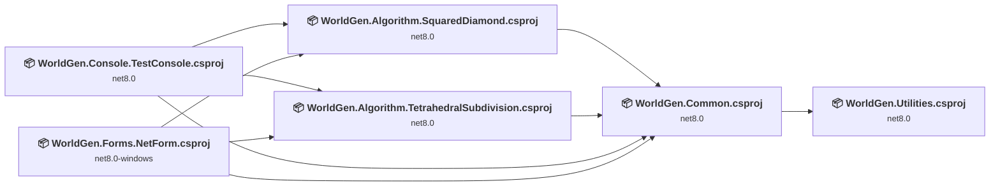
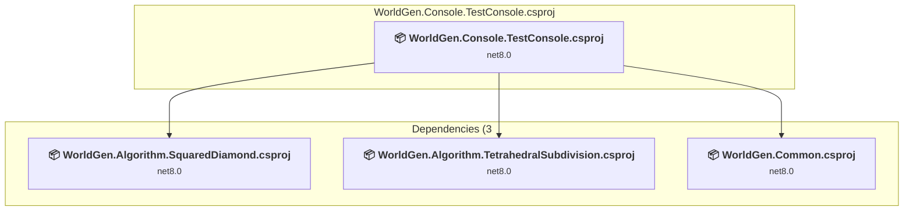
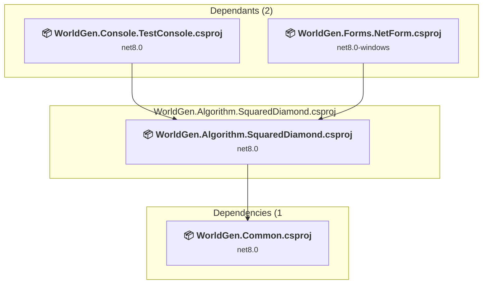
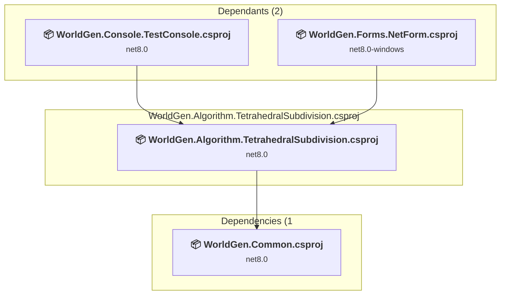
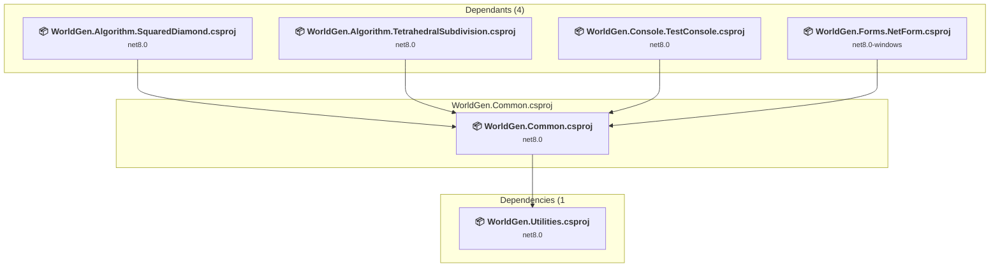
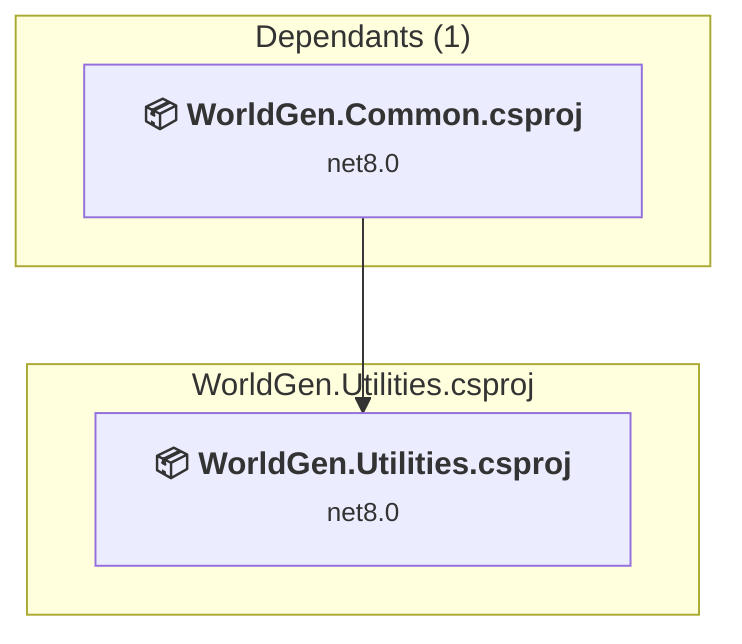
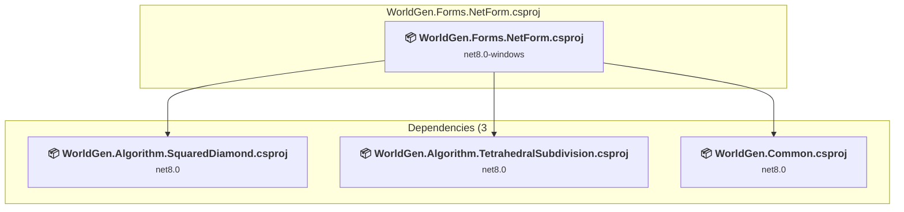

# Projects and dependencies analysis

This document provides a comprehensive overview of the projects and their dependencies in the context of upgrading to .NETCoreApp,Version=v10.0.

## Table of Contents

- [Executive Summary](#executive-Summary)
  - [Highlevel Metrics](#highlevel-metrics)
  - [Projects Compatibility](#projects-compatibility)
  - [Package Compatibility](#package-compatibility)
  - [API Compatibility](#api-compatibility)
- [Aggregate NuGet packages details](#aggregate-nuget-packages-details)
- [Top API Migration Challenges](#top-api-migration-challenges)
  - [Technologies and Features](#technologies-and-features)
  - [Most Frequent API Issues](#most-frequent-api-issues)
- [Projects Relationship Graph](#projects-relationship-graph)
- [Project Details](#project-details)

  - [Console\WorldGen.Console.TestConsole\WorldGen.Console.TestConsole.csproj](#consoleworldgenconsoletestconsoleworldgenconsoletestconsolecsproj)
  - [Core\Algorithm\WorldGen.Algorithm.SquaredDiamond\WorldGen.Algorithm.SquaredDiamond.csproj](#corealgorithmworldgenalgorithmsquareddiamondworldgenalgorithmsquareddiamondcsproj)
  - [Core\Algorithm\WorldGen.Algorithm.TetrahedralSubdivision\WorldGen.Algorithm.TetrahedralSubdivision.csproj](#corealgorithmworldgenalgorithmtetrahedralsubdivisionworldgenalgorithmtetrahedralsubdivisioncsproj)
  - [Core\WorldGen.Common\WorldGen.Common.csproj](#coreworldgencommonworldgencommoncsproj)
  - [Core\WorldGen.Utilities\WorldGen.Utilities.csproj](#coreworldgenutilitiesworldgenutilitiescsproj)
  - [Forms\WorldGen.Forms.NetForm\WorldGen.Forms.NetForm.csproj](#formsworldgenformsnetformworldgenformsnetformcsproj)

## Executive Summary

### Highlevel Metrics

| Metric | Count | Status |
| :--- | :---: | :--- |
| Total Projects | 6 | All require upgrade |
| Total NuGet Packages | 2 | 1 need upgrade |
| Total Code Files | 31 |  |
| Total Code Files with Incidents | 16 |  |
| Total Lines of Code | 4262 |  |
| Total Number of Issues | 1135 |  |
| Estimated LOC to modify | 1122+ | at least 26,3% of codebase |

### Projects Compatibility

| Project | Target Framework | Difficulty | Package Issues | API Issues | Est. LOC Impact | Description |
| :--- | :---: | :---: | :---: | :---: | :---: | :--- |
| [Console\WorldGen.Console.TestConsole\WorldGen.Console.TestConsole.csproj](#consoleworldgenconsoletestconsoleworldgenconsoletestconsolecsproj) | net8.0 | 🟢 Low | 1 | 0 |  | DotNetCoreApp, Sdk Style = True |
| [Core\Algorithm\WorldGen.Algorithm.SquaredDiamond\WorldGen.Algorithm.SquaredDiamond.csproj](#corealgorithmworldgenalgorithmsquareddiamondworldgenalgorithmsquareddiamondcsproj) | net8.0 | 🟢 Low | 1 | 0 |  | ClassLibrary, Sdk Style = True |
| [Core\Algorithm\WorldGen.Algorithm.TetrahedralSubdivision\WorldGen.Algorithm.TetrahedralSubdivision.csproj](#corealgorithmworldgenalgorithmtetrahedralsubdivisionworldgenalgorithmtetrahedralsubdivisioncsproj) | net8.0 | 🟢 Low | 1 | 0 |  | ClassLibrary, Sdk Style = True |
| [Core\WorldGen.Common\WorldGen.Common.csproj](#coreworldgencommonworldgencommoncsproj) | net8.0 | 🟢 Low | 2 | 0 |  | ClassLibrary, Sdk Style = True |
| [Core\WorldGen.Utilities\WorldGen.Utilities.csproj](#coreworldgenutilitiesworldgenutilitiescsproj) | net8.0 | 🟢 Low | 1 | 0 |  | ClassLibrary, Sdk Style = True |
| [Forms\WorldGen.Forms.NetForm\WorldGen.Forms.NetForm.csproj](#formsworldgenformsnetformworldgenformsnetformcsproj) | net8.0-windows | 🟡 Medium | 1 | 1122 | 1122+ | WinForms, Sdk Style = True |

### Package Compatibility

| Status | Count | Percentage |
| :--- | :---: | :---: |
| ✅ Compatible | 1 | 50,0% |
| ⚠️ Incompatible | 0 | 0,0% |
| 🔄 Upgrade Recommended | 1 | 50,0% |
| ***Total NuGet Packages*** | ***2*** | ***100%*** |

### API Compatibility

| Category | Count | Impact |
| :--- | :---: | :--- |
| 🔴 Binary Incompatible | 1066 | High - Require code changes |
| 🟡 Source Incompatible | 56 | Medium - Needs re-compilation and potential conflicting API error fixing |
| 🔵 Behavioral change | 0 | Low - Behavioral changes that may require testing at runtime |
| ✅ Compatible | 3202 |  |
| ***Total APIs Analyzed*** | ***4324*** |  |

## Aggregate NuGet packages details

| Package | Current Version | Suggested Version | Projects | Description |
| :--- | :---: | :---: | :--- | :--- |
| SixLabors.ImageSharp | 3.1.2 | 3.1.12 | [WorldGen.Common.csproj](#coreworldgencommonworldgencommoncsproj) | El paquete NuGet contiene una vulnerabilidad de seguridad. |
| SixLabors.ImageSharp.Drawing | 2.1.1 |  | [WorldGen.Common.csproj](#coreworldgencommonworldgencommoncsproj) | ✅Compatible |

## Top API Migration Challenges

### Technologies and Features

| Technology | Issues | Percentage | Migration Path |
| :--- | :---: | :---: | :--- |
| Windows Forms | 1066 | 95,0% | Windows Forms APIs for building Windows desktop applications with traditional Forms-based UI that are available in .NET on Windows. Enable Windows Desktop support: Option 1 (Recommended): Target net9.0-windows; Option 2: Add <UseWindowsDesktop>true</UseWindowsDesktop>; Option 3 (Legacy): Use Microsoft.NET.Sdk.WindowsDesktop SDK. |
| GDI+ / System.Drawing | 56 | 5,0% | System.Drawing APIs for 2D graphics, imaging, and printing that are available via NuGet package System.Drawing.Common. Note: Not recommended for server scenarios due to Windows dependencies; consider cross-platform alternatives like SkiaSharp or ImageSharp for new code. |

### Most Frequent API Issues

| API | Count | Percentage | Category |
| :--- | :---: | :---: | :--- |
| T:System.Windows.Forms.NumericUpDown | 154 | 13,7% | Binary Incompatible |
| T:System.Windows.Forms.Label | 141 | 12,6% | Binary Incompatible |
| T:System.Windows.Forms.GroupBox | 70 | 6,2% | Binary Incompatible |
| T:System.Windows.Forms.Button | 58 | 5,2% | Binary Incompatible |
| T:System.Drawing.ContentAlignment | 42 | 3,7% | Source Incompatible |
| P:System.Windows.Forms.Control.Name | 40 | 3,6% | Binary Incompatible |
| T:System.Windows.Forms.Control.ControlCollection | 39 | 3,5% | Binary Incompatible |
| P:System.Windows.Forms.Control.Controls | 39 | 3,5% | Binary Incompatible |
| M:System.Windows.Forms.Control.ControlCollection.Add(System.Windows.Forms.Control) | 39 | 3,5% | Binary Incompatible |
| P:System.Windows.Forms.Control.Size | 39 | 3,5% | Binary Incompatible |
| P:System.Windows.Forms.Control.Location | 37 | 3,3% | Binary Incompatible |
| P:System.Windows.Forms.Control.TabIndex | 35 | 3,1% | Binary Incompatible |
| T:System.Windows.Forms.ComboBox | 30 | 2,7% | Binary Incompatible |
| T:System.Windows.Forms.TabPage | 30 | 2,7% | Binary Incompatible |
| T:System.Windows.Forms.PictureBox | 26 | 2,3% | Binary Incompatible |
| T:System.Windows.Forms.DockStyle | 24 | 2,1% | Binary Incompatible |
| P:System.Windows.Forms.NumericUpDown.Value | 23 | 2,0% | Binary Incompatible |
| P:System.Windows.Forms.Label.Text | 15 | 1,3% | Binary Incompatible |
| T:System.Windows.Forms.TabControl | 14 | 1,2% | Binary Incompatible |
| P:System.Windows.Forms.Label.TextAlign | 14 | 1,2% | Binary Incompatible |
| M:System.Windows.Forms.Label.#ctor | 14 | 1,2% | Binary Incompatible |
| F:System.Drawing.ContentAlignment.MiddleLeft | 13 | 1,2% | Source Incompatible |
| P:System.Windows.Forms.NumericUpDown.Minimum | 10 | 0,9% | Binary Incompatible |
| M:System.Windows.Forms.NumericUpDown.#ctor | 10 | 0,9% | Binary Incompatible |
| P:System.Windows.Forms.NumericUpDown.Maximum | 9 | 0,8% | Binary Incompatible |
| M:System.Windows.Forms.Control.SuspendLayout | 8 | 0,7% | Binary Incompatible |
| P:System.Windows.Forms.Control.Dock | 8 | 0,7% | Binary Incompatible |
| M:System.Windows.Forms.Control.ResumeLayout(System.Boolean) | 7 | 0,6% | Binary Incompatible |
| T:System.Windows.Forms.ComboBoxStyle | 6 | 0,5% | Binary Incompatible |
| P:System.Windows.Forms.NumericUpDown.DecimalPlaces | 6 | 0,5% | Binary Incompatible |
| E:System.Windows.Forms.Control.Click | 5 | 0,4% | Binary Incompatible |
| P:System.Windows.Forms.ButtonBase.UseVisualStyleBackColor | 5 | 0,4% | Binary Incompatible |
| P:System.Windows.Forms.ButtonBase.Text | 5 | 0,4% | Binary Incompatible |
| P:System.Windows.Forms.NumericUpDown.Increment | 5 | 0,4% | Binary Incompatible |
| M:System.Windows.Forms.Button.#ctor | 5 | 0,4% | Binary Incompatible |
| T:System.Windows.Forms.Application | 4 | 0,4% | Binary Incompatible |
| F:System.Windows.Forms.DockStyle.Left | 4 | 0,4% | Binary Incompatible |
| T:System.Windows.Forms.Padding | 4 | 0,4% | Binary Incompatible |
| T:System.Windows.Forms.AutoScaleMode | 3 | 0,3% | Binary Incompatible |
| P:System.Windows.Forms.GroupBox.Text | 3 | 0,3% | Binary Incompatible |
| P:System.Windows.Forms.GroupBox.TabStop | 3 | 0,3% | Binary Incompatible |
| F:System.Windows.Forms.DockStyle.Bottom | 3 | 0,3% | Binary Incompatible |
| M:System.Windows.Forms.GroupBox.#ctor | 3 | 0,3% | Binary Incompatible |
| T:System.Windows.Forms.HighDpiMode | 2 | 0,2% | Binary Incompatible |
| P:System.Windows.Forms.ListControl.FormattingEnabled | 2 | 0,2% | Binary Incompatible |
| F:System.Windows.Forms.ComboBoxStyle.DropDownList | 2 | 0,2% | Binary Incompatible |
| P:System.Windows.Forms.ComboBox.DropDownStyle | 2 | 0,2% | Binary Incompatible |
| P:System.Windows.Forms.PictureBox.TabStop | 2 | 0,2% | Binary Incompatible |
| P:System.Windows.Forms.PictureBox.TabIndex | 2 | 0,2% | Binary Incompatible |
| P:System.Windows.Forms.TabPage.UseVisualStyleBackColor | 2 | 0,2% | Binary Incompatible |

## Projects Relationship Graph

Legend:
📦 SDK-style project
⚙️ Classic project

## Project Details

### Console\WorldGen.Console.TestConsole\WorldGen.Console.TestConsole.csproj

#### Project Info

- **Current Target Framework:** net8.0
- **Proposed Target Framework:** net10.0
- **SDK-style**: True
- **Project Kind:** DotNetCoreApp
- **Dependencies**: 3
- **Dependants**: 0
- **Number of Files**: 1
- **Number of Files with Incidents**: 2
- **Lines of Code**: 117
- **Estimated LOC to modify**: 0+ (at least 0,0% of the project)

#### Dependency Graph

Legend:
📦 SDK-style project
⚙️ Classic project

### API Compatibility

| Category | Count | Impact |
| :--- | :---: | :--- |
| 🔴 Binary Incompatible | 0 | High - Require code changes |
| 🟡 Source Incompatible | 0 | Medium - Needs re-compilation and potential conflicting API error fixing |
| 🔵 Behavioral change | 0 | Low - Behavioral changes that may require testing at runtime |
| ✅ Compatible | 78 |  |
| ***Total APIs Analyzed*** | ***78*** |  |

### Core\Algorithm\WorldGen.Algorithm.SquaredDiamond\WorldGen.Algorithm.SquaredDiamond.csproj

#### Project Info

- **Current Target Framework:** net8.0
- **Proposed Target Framework:** net10.0
- **SDK-style**: True
- **Project Kind:** ClassLibrary
- **Dependencies**: 1
- **Dependants**: 2
- **Number of Files**: 1
- **Number of Files with Incidents**: 2
- **Lines of Code**: 241
- **Estimated LOC to modify**: 0+ (at least 0,0% of the project)

#### Dependency Graph

Legend:
📦 SDK-style project
⚙️ Classic project

### API Compatibility

| Category | Count | Impact |
| :--- | :---: | :--- |
| 🔴 Binary Incompatible | 0 | High - Require code changes |
| 🟡 Source Incompatible | 0 | Medium - Needs re-compilation and potential conflicting API error fixing |
| 🔵 Behavioral change | 0 | Low - Behavioral changes that may require testing at runtime |
| ✅ Compatible | 158 |  |
| ***Total APIs Analyzed*** | ***158*** |  |

### Core\Algorithm\WorldGen.Algorithm.TetrahedralSubdivision\WorldGen.Algorithm.TetrahedralSubdivision.csproj

#### Project Info

- **Current Target Framework:** net8.0
- **Proposed Target Framework:** net10.0
- **SDK-style**: True
- **Project Kind:** ClassLibrary
- **Dependencies**: 1
- **Dependants**: 2
- **Number of Files**: 5
- **Number of Files with Incidents**: 2
- **Lines of Code**: 1892
- **Estimated LOC to modify**: 0+ (at least 0,0% of the project)

#### Dependency Graph

Legend:
📦 SDK-style project
⚙️ Classic project

### API Compatibility

| Category | Count | Impact |
| :--- | :---: | :--- |
| 🔴 Binary Incompatible | 0 | High - Require code changes |
| 🟡 Source Incompatible | 0 | Medium - Needs re-compilation and potential conflicting API error fixing |
| 🔵 Behavioral change | 0 | Low - Behavioral changes that may require testing at runtime |
| ✅ Compatible | 1506 |  |
| ***Total APIs Analyzed*** | ***1506*** |  |

### Core\WorldGen.Common\WorldGen.Common.csproj

#### Project Info

- **Current Target Framework:** net8.0
- **Proposed Target Framework:** net10.0
- **SDK-style**: True
- **Project Kind:** ClassLibrary
- **Dependencies**: 1
- **Dependants**: 4
- **Number of Files**: 13
- **Number of Files with Incidents**: 2
- **Lines of Code**: 904
- **Estimated LOC to modify**: 0+ (at least 0,0% of the project)

#### Dependency Graph

Legend:
📦 SDK-style project
⚙️ Classic project

### API Compatibility

| Category | Count | Impact |
| :--- | :---: | :--- |
| 🔴 Binary Incompatible | 0 | High - Require code changes |
| 🟡 Source Incompatible | 0 | Medium - Needs re-compilation and potential conflicting API error fixing |
| 🔵 Behavioral change | 0 | Low - Behavioral changes that may require testing at runtime |
| ✅ Compatible | 604 |  |
| ***Total APIs Analyzed*** | ***604*** |  |

### Core\WorldGen.Utilities\WorldGen.Utilities.csproj

#### Project Info

- **Current Target Framework:** net8.0
- **Proposed Target Framework:** net10.0
- **SDK-style**: True
- **Project Kind:** ClassLibrary
- **Dependencies**: 0
- **Dependants**: 1
- **Number of Files**: 8
- **Number of Files with Incidents**: 2
- **Lines of Code**: 218
- **Estimated LOC to modify**: 0+ (at least 0,0% of the project)

#### Dependency Graph

Legend:
📦 SDK-style project
⚙️ Classic project

### API Compatibility

| Category | Count | Impact |
| :--- | :---: | :--- |
| 🔴 Binary Incompatible | 0 | High - Require code changes |
| 🟡 Source Incompatible | 0 | Medium - Needs re-compilation and potential conflicting API error fixing |
| 🔵 Behavioral change | 0 | Low - Behavioral changes that may require testing at runtime |
| ✅ Compatible | 103 |  |
| ***Total APIs Analyzed*** | ***103*** |  |

### Forms\WorldGen.Forms.NetForm\WorldGen.Forms.NetForm.csproj

#### Project Info

- **Current Target Framework:** net8.0-windows
- **Proposed Target Framework:** net10.0-windows
- **SDK-style**: True
- **Project Kind:** WinForms
- **Dependencies**: 3
- **Dependants**: 0
- **Number of Files**: 4
- **Number of Files with Incidents**: 6
- **Lines of Code**: 890
- **Estimated LOC to modify**: 1122+ (at least 126,1% of the project)

#### Dependency Graph

Legend:
📦 SDK-style project
⚙️ Classic project

### API Compatibility

| Category | Count | Impact |
| :--- | :---: | :--- |
| 🔴 Binary Incompatible | 1066 | High - Require code changes |
| 🟡 Source Incompatible | 56 | Medium - Needs re-compilation and potential conflicting API error fixing |
| 🔵 Behavioral change | 0 | Low - Behavioral changes that may require testing at runtime |
| ✅ Compatible | 753 |  |
| ***Total APIs Analyzed*** | ***1875*** |  |

#### Project Technologies and Features

| Technology | Issues | Percentage | Migration Path |
| :--- | :---: | :---: | :--- |
| GDI+ / System.Drawing | 56 | 5,0% | System.Drawing APIs for 2D graphics, imaging, and printing that are available via NuGet package System.Drawing.Common. Note: Not recommended for server scenarios due to Windows dependencies; consider cross-platform alternatives like SkiaSharp or ImageSharp for new code. |
| Windows Forms | 1066 | 95,0% | Windows Forms APIs for building Windows desktop applications with traditional Forms-based UI that are available in .NET on Windows. Enable Windows Desktop support: Option 1 (Recommended): Target net9.0-windows; Option 2: Add <UseWindowsDesktop>true</UseWindowsDesktop>; Option 3 (Legacy): Use Microsoft.NET.Sdk.WindowsDesktop SDK. |

