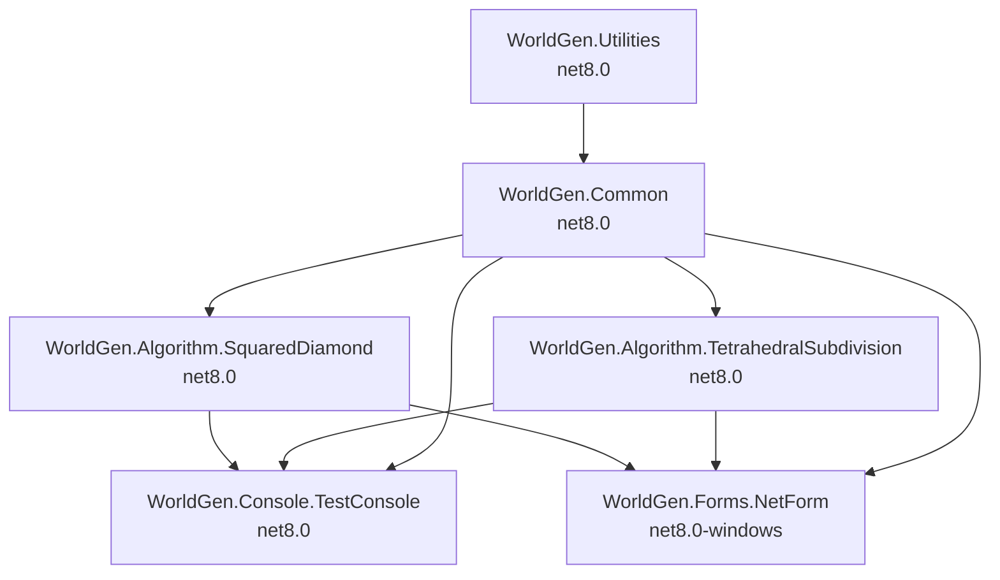

# .NET 10 Upgrade Migration Plan

## Table of Contents

- [Executive Summary](#executive-summary)
- [Migration Strategy](#migration-strategy)
- [Detailed Dependency Analysis](#detailed-dependency-analysis)
- [Project-by-Project Migration Plans](#project-by-project-migration-plans)
  - [WorldGen.Utilities](#worldgenutilities)
  - [WorldGen.Common](#worldgencommon)
  - [WorldGen.Algorithm.SquaredDiamond](#worldgenalgorithmsquareddiamond)
  - [WorldGen.Algorithm.TetrahedralSubdivision](#worldgenalgorithmtetrahedralsubdivision)
  - [WorldGen.Console.TestConsole](#worldgenconsoletestconsole)
  - [WorldGen.Forms.NetForm](#worldgenformsnetform)
- [Package Update Reference](#package-update-reference)
- [Breaking Changes Catalog](#breaking-changes-catalog)
- [Risk Management](#risk-management)
- [Complexity & Effort Assessment](#complexity--effort-assessment)
- [Testing & Validation Strategy](#testing--validation-strategy)
- [Source Control Strategy](#source-control-strategy)
- [Success Criteria](#success-criteria)

---

## Executive Summary

### Scenario Description
This plan guides the upgrade of the DCCartographySuite solution from **.NET 8** to **.NET 10 (LTS)**, migrating all 6 projects to the latest long-term support framework version.

### Scope

**Projects Affected:** 6 projects
- 4 Core library projects (Utilities, Common, SquaredDiamond algorithm, TetrahedralSubdivision algorithm)
- 1 Console application (TestConsole)
- 1 Windows Forms application (NetForm)

**Current State:**
- All projects currently target .NET 8.0 (net8.0 or net8.0-windows)
- All projects use SDK-style project format
- Total codebase: 4,262 lines of code across 31 files
- 2 NuGet packages in use

**Target State:**
- All projects upgraded to .NET 10.0 (net10.0 or net10.0-windows)
- Security vulnerability addressed (SixLabors.ImageSharp 3.1.2 ? 3.1.12)
- All API compatibility issues resolved in Windows Forms project
- Modern .NET 10 features available across solution

### Selected Strategy

**All-At-Once Strategy** - All projects upgraded simultaneously in single atomic operation.

**Rationale:**
- **Small solution size**: 6 projects is well within All-At-Once threshold
- **Homogeneous framework**: All projects currently on .NET 8, simplifying coordination
- **Clear dependency structure**: 2-level depth, no circular dependencies, easy to manage
- **Package compatibility**: All packages have .NET 10-compatible versions available
- **Low overall complexity**: 5 of 6 projects have zero API compatibility issues
- **Efficiency**: Minimizes total upgrade time and avoids multi-targeting complexity

### Complexity Assessment

**Discovered Metrics:**
- **Total Projects**: 6
- **Dependency Depth**: 2 levels
- **Circular Dependencies**: None
- **Security Vulnerabilities**: 1 (SixLabors.ImageSharp - MODERATE severity)
- **High-Risk Projects**: 0
- **Medium-Risk Projects**: 1 (WorldGen.Forms.NetForm - 1,122 API issues)
- **Low-Risk Projects**: 5
- **Total LOC**: 4,262
- **Estimated LOC Impact**: 1,122+ (26.3% of codebase, concentrated in Forms project)

**Complexity Classification**: **Simple Solution**

### Critical Issues

**Security Vulnerability (CRITICAL - Address Immediately):**
- **Package**: SixLabors.ImageSharp
- **Current Version**: 3.1.2
- **Target Version**: 3.1.12
- **Project**: WorldGen.Common
- **Severity**: Moderate
- **Action**: Upgrade as part of atomic migration

**API Compatibility (MEDIUM):**
- **Project**: WorldGen.Forms.NetForm
- **Issue Count**: 1,122 API issues (1,066 binary incompatible, 56 source incompatible)
- **Technologies Affected**: Windows Forms (95%), System.Drawing/GDI+ (5%)
- **Migration Path**: Ensure net10.0-windows target framework, verify Windows Desktop SDK support
- **Note**: Most issues are designer-generated code that will auto-resolve with proper framework targeting

### Recommended Approach

**All-At-Once Atomic Upgrade:**
1. Update all 6 project files to net10.0/net10.0-windows simultaneously
2. Upgrade SixLabors.ImageSharp to secure version (3.1.12) in same operation
3. Restore dependencies for entire solution
4. Build solution and address any compilation errors as unified batch
5. Validate Windows Forms designer compatibility
6. Run comprehensive testing

**Expected Duration Characteristics:**
- **Preparation**: Low (SDK verification, branch setup)
- **Execution**: Medium (1 atomic upgrade task, focused troubleshooting)
- **Validation**: Medium (comprehensive testing of all projects)

### Iteration Strategy

This plan uses a **fast batch approach** due to simple solution classification:
- **Phase 1**: Discovery & Classification (3 iterations) ?
- **Phase 2**: Foundation sections (3 iterations)
- **Phase 3**: Batch all project details (1-2 iterations)
- **Total Expected**: 7-8 iterations

---

## Migration Strategy

### Approach Selection

**Selected Strategy: All-At-Once**

All 6 projects in the DCCartographySuite solution will be upgraded simultaneously in a single atomic operation, transitioning from .NET 8.0 to .NET 10.0 in one coordinated batch.

### Justification

**Why All-At-Once is Optimal:**

1. **Solution Size (6 projects)**: Well below the threshold where incremental migration provides value. Small enough to manage as single unit.

2. **Homogeneous Source Framework**: All projects currently on .NET 8.0 (or .NET 8.0-windows for Forms project). No mixed .NET Framework/Core scenarios requiring staged migration.

3. **Clear Dependency Structure**: 
   - Only 2 levels of dependency depth
   - No circular dependencies
   - Well-defined dependency flow: Utilities ? Common ? Algorithms ? Applications

4. **Package Compatibility**:
   - Only 2 unique NuGet packages across solution
   - Both packages have .NET 10-compatible versions available
   - Security vulnerability has clear upgrade path (3.1.2 ? 3.1.12)

5. **Low Overall Complexity**:
   - 5 of 6 projects have **zero** API compatibility issues
   - 1 project (Forms) has API issues, but most are designer-generated code
   - Total codebase is modest (4,262 LOC)

6. **Risk Profile**:
   - 5 low-risk projects can upgrade cleanly
   - 1 medium-risk project (Forms) has well-understood migration path
   - No high-risk projects requiring special handling

7. **Efficiency Benefits**:
   - Single build/test cycle instead of multiple rounds
   - No multi-targeting complexity or intermediate states
   - Faster overall completion time
   - Simpler source control history (one upgrade commit)

**Why NOT Incremental:**
- Incremental migration adds overhead (multi-targeting, multiple test cycles) without providing meaningful risk reduction for a 6-project solution
- All projects must eventually upgrade anyway; staging provides no benefit
- Dependency depth is shallow enough to handle atomically

### All-At-Once Strategy Rationale

**Atomic Operation Characteristics:**
- All project files updated to target framework in single pass
- All package references updated simultaneously
- Single dependency restore operation
- One comprehensive build to identify all compilation errors
- Unified troubleshooting and error resolution
- Single test cycle validates entire solution

**Advantages for This Solution:**
- **Speed**: Fastest path to completion
- **Simplicity**: No intermediate states to maintain
- **Clean History**: Single logical upgrade commit
- **Immediate Benefits**: All projects gain .NET 10 features at once
- **Simplified Testing**: Validate entire solution in final state

**Challenges Mitigated:**
- **Windows Forms API Issues**: Expected and well-understood; most will auto-resolve with proper framework targeting
- **Security Vulnerability**: Addressed in same operation as framework upgrade
- **Testing Surface**: Manageable due to small solution size

### Dependency-Based Ordering

While All-At-Once upgrades all projects simultaneously, understanding dependency order is still important for troubleshooting and verification:

**Logical Execution Order (if issues arise):**
1. **Utilities** (no dependencies)
2. **Common** (depends on Utilities)
3. **Algorithm projects** (depend on Common) - can be addressed in parallel
4. **Applications** (depend on algorithms + Common) - can be addressed in parallel

**Build Verification Strategy:**
- Update all project files simultaneously
- Restore packages for entire solution
- Build in dependency order to isolate issues:
  - First: Utilities
  - Second: Common
  - Third: Algorithm projects
  - Fourth: Application projects

### Parallel vs Sequential Execution

**Project File Updates**: Sequential (automated tooling)
**Package Updates**: Simultaneous (single restore operation)
**Build Process**: Dependency-ordered (MSBuild handles automatically)
**Error Resolution**: Sequential by dependency level if issues arise
**Testing**: Parallel where possible (unit tests), sequential for integration

### Phase Definitions

**Phase 0: Preparation** (Prerequisites)
- Verify .NET 10 SDK installed
- Confirm branch setup (upgrade-to-NET10)
- Validate no uncommitted changes
- Document baseline state

**Phase 1: Atomic Upgrade** (All Projects)
- Update all 6 project files to target framework net10.0/net10.0-windows
- Upgrade SixLabors.ImageSharp to 3.1.12 in WorldGen.Common
- Restore dependencies for entire solution
- Build solution and address compilation errors
- Verify Windows Forms designer functionality
- **Deliverable**: Solution builds with 0 errors

**Phase 2: Validation** (Comprehensive Testing)
- Run build for all projects individually
- Validate dependency resolution
- Test Windows Forms application manually
- Test Console application functionality
- Verify security vulnerability resolved
- **Deliverable**: All validation criteria met

**Phase 3: Completion** (Finalization)
- Commit changes with descriptive message
- Update documentation
- Tag release if applicable
- **Deliverable**: Upgrade complete and committed

---

## Detailed Dependency Analysis

### Dependency Graph Summary

The solution has a clean, hierarchical dependency structure with 2 levels of depth and no circular dependencies:

```
Level 0 (Leaf - No Dependencies):
  ?? WorldGen.Utilities

Level 1 (Depends on Level 0):
  ?? WorldGen.Common ? WorldGen.Utilities

Level 2 (Depends on Level 1):
  ?? WorldGen.Algorithm.SquaredDiamond ? WorldGen.Common
  ?? WorldGen.Algorithm.TetrahedralSubdivision ? WorldGen.Common
  ?? WorldGen.Console.TestConsole ? WorldGen.Common, SquaredDiamond, TetrahedralSubdivision
  ?? WorldGen.Forms.NetForm ? WorldGen.Common, SquaredDiamond, TetrahedralSubdivision
```

**Visual Dependency Flow:**



### Project Groupings by Migration Phase

**All-At-Once Strategy: Single Atomic Phase**

All 6 projects will be upgraded simultaneously in one coordinated operation:

**Atomic Upgrade Group (All Projects)**:
1. **WorldGen.Utilities** (Level 0 - Leaf)
   - No project dependencies
   - Depended upon by: WorldGen.Common
   - Risk: Low
   
2. **WorldGen.Common** (Level 1 - Core)
   - Depends on: WorldGen.Utilities
   - Depended upon by: All algorithm and application projects
   - Contains security vulnerability (SixLabors.ImageSharp)
   - Risk: Low (post security fix)
   
3. **WorldGen.Algorithm.SquaredDiamond** (Level 2 - Algorithm)
   - Depends on: WorldGen.Common
   - Depended upon by: Console and Forms applications
   - Risk: Low
   
4. **WorldGen.Algorithm.TetrahedralSubdivision** (Level 2 - Algorithm)
   - Depends on: WorldGen.Common
   - Depended upon by: Console and Forms applications
   - Risk: Low
   
5. **WorldGen.Console.TestConsole** (Level 2 - Application)
   - Depends on: Both algorithm projects + WorldGen.Common
   - No dependents (top-level application)
   - Risk: Low
   
6. **WorldGen.Forms.NetForm** (Level 2 - Application)
   - Depends on: Both algorithm projects + WorldGen.Common
   - No dependents (top-level application)
   - Contains Windows Forms API compatibility issues
   - Risk: Medium

**Rationale for Single-Phase Approach:**
- Small solution size enables atomic upgrade without excessive risk
- All projects currently on same framework version (.NET 8)
- Dependency structure is shallow and clean
- No multi-targeting complexity needed
- Faster completion time with single coordinated operation
- All projects benefit from .NET 10 features simultaneously

### Critical Path Identification

**Primary Critical Path** (longest dependency chain):
```
WorldGen.Utilities ? WorldGen.Common ? WorldGen.Algorithm.* ? Applications
```

**Key Observations:**
- **WorldGen.Common** is the central hub (4 dependents)
- Security vulnerability fix in WorldGen.Common affects all downstream projects
- Windows Forms project (NetForm) is at end of dependency chain (low impact on others)
- Console application is also at end of chain (can fail independently)

**All-At-Once Implications:**
- All dependencies resolve simultaneously in single pass
- Security fix propagates to all dependent projects immediately
- No need to track intermediate states
- Single build/test cycle validates entire solution

### Circular Dependencies

**Status**: ? None detected

The dependency graph is a proper directed acyclic graph (DAG), which simplifies the upgrade process significantly.

---

## Project-by-Project Migration Plans

All projects upgrade simultaneously as part of the All-At-Once strategy. The following details provide per-project specifications for reference during the atomic upgrade operation.

---

### WorldGen.Utilities

**Project Type**: Class Library  
**Location**: `Core\WorldGen.Utilities\WorldGen.Utilities.csproj`

#### Current State
- **Target Framework**: net8.0
- **SDK Style**: True
- **Project Dependencies**: None (leaf node)
- **Dependent Projects**: WorldGen.Common
- **NuGet Packages**: None
- **Lines of Code**: 218
- **Files**: 8
- **Risk Level**: ?? Low

#### Target State
- **Target Framework**: net10.0
- **Package Changes**: None
- **Expected Issues**: None

#### Migration Steps

1. **Prerequisites**
   - None (leaf node project)

2. **Target Framework Update**
   - Update `<TargetFramework>` in project file from `net8.0` to `net10.0`
   - Location: `Core\WorldGen.Utilities\WorldGen.Utilities.csproj`
   - Change: `<TargetFramework>net8.0</TargetFramework>` ? `<TargetFramework>net10.0</TargetFramework>`

3. **Package Updates**
   - None required

4. **Expected Breaking Changes**
   - None identified in assessment
   - Standard .NET 8 ? .NET 10 compatibility maintained

5. **Code Modifications**
   - No code changes expected
   - Verify utility functions after build

6. **Testing Strategy**
   - Build verification
   - Dependent project (WorldGen.Common) integration test
   - Functional validation through consumer projects

7. **Validation Checklist**
   - [ ] Project builds without errors
   - [ ] Project builds without warnings
   - [ ] No dependency conflicts
   - [ ] WorldGen.Common successfully references updated project

---

### WorldGen.Common

**Project Type**: Class Library  
**Location**: `Core\WorldGen.Common\WorldGen.Common.csproj`

#### Current State
- **Target Framework**: net8.0
- **SDK Style**: True
- **Project Dependencies**: WorldGen.Utilities
- **Dependent Projects**: WorldGen.Algorithm.SquaredDiamond, WorldGen.Algorithm.TetrahedralSubdivision, WorldGen.Console.TestConsole, WorldGen.Forms.NetForm
- **NuGet Packages**: 
  - SixLabors.ImageSharp 3.1.2 ?? **SECURITY VULNERABILITY**
  - SixLabors.ImageSharp.Drawing 2.1.1 (compatible)
- **Lines of Code**: 904
- **Files**: 13
- **Risk Level**: ?? Medium (due to security vulnerability)

#### Target State
- **Target Framework**: net10.0
- **Package Changes**: 
  - SixLabors.ImageSharp: 3.1.2 ? **3.1.12** (security fix)
  - SixLabors.ImageSharp.Drawing: 2.1.1 (no change, already compatible)
- **Expected Issues**: Potential ImageSharp API changes

#### Migration Steps

1. **Prerequisites**
   - WorldGen.Utilities must be updated first (handled atomically in All-At-Once)

2. **Target Framework Update**
   - Update `<TargetFramework>` in project file from `net8.0` to `net10.0`
   - Location: `Core\WorldGen.Common\WorldGen.Common.csproj`
   - Change: `<TargetFramework>net8.0</TargetFramework>` ? `<TargetFramework>net10.0</TargetFramework>`

3. **Package Updates**
   - **CRITICAL**: Upgrade SixLabors.ImageSharp to address security vulnerability
   - Update `<PackageReference Include="SixLabors.ImageSharp" Version="3.1.2" />` to `Version="3.1.12"`
   - Verify SixLabors.ImageSharp.Drawing 2.1.1 remains compatible with ImageSharp 3.1.12
   - Location: `Core\WorldGen.Common\WorldGen.Common.csproj`

4. **Expected Breaking Changes**
   - Review SixLabors.ImageSharp [3.1.2 ? 3.1.12 changelog](https://github.com/SixLabors/ImageSharp/releases)
   - Minor version updates typically maintain API compatibility
   - Potential behavioral changes in image processing algorithms
   - Possible performance characteristic changes

5. **Code Modifications**
   - Search codebase for ImageSharp API usage
   - Verify all image processing operations:
     - Image loading/saving
     - Format conversions
     - Pixel manipulation
     - Drawing operations (via ImageSharp.Drawing)
   - Update API calls if ImageSharp introduced deprecations
   - Check for compiler warnings about obsolete methods

6. **Testing Strategy**
   - Build verification
   - Unit tests for image processing functions (if available)
   - Visual validation of image outputs
   - Performance comparison before/after upgrade
   - Security scan to confirm vulnerability remediated

7. **Validation Checklist**
   - [ ] Project builds without errors
   - [ ] Project builds without warnings
   - [ ] SixLabors.ImageSharp upgraded to 3.1.12
   - [ ] Security vulnerability resolved (verify with `dotnet list package --vulnerable`)
   - [ ] Image processing functionality intact
   - [ ] All dependent projects build successfully

---

### WorldGen.Algorithm.SquaredDiamond

**Project Type**: Class Library  
**Location**: `Core\Algorithm\WorldGen.Algorithm.SquaredDiamond\WorldGen.Algorithm.SquaredDiamond.csproj`

#### Current State
- **Target Framework**: net8.0
- **SDK Style**: True
- **Project Dependencies**: WorldGen.Common
- **Dependent Projects**: WorldGen.Console.TestConsole, WorldGen.Forms.NetForm
- **NuGet Packages**: None
- **Lines of Code**: 241
- **Files**: 1
- **Risk Level**: ?? Low

#### Target State
- **Target Framework**: net10.0
- **Package Changes**: None
- **Expected Issues**: None (algorithm validation recommended)

#### Migration Steps

1. **Prerequisites**
   - WorldGen.Common must be updated first (handled atomically in All-At-Once)

2. **Target Framework Update**
   - Update `<TargetFramework>` in project file from `net8.0` to `net10.0`
   - Location: `Core\Algorithm\WorldGen.Algorithm.SquaredDiamond\WorldGen.Algorithm.SquaredDiamond.csproj`
   - Change: `<TargetFramework>net8.0</TargetFramework>` ? `<TargetFramework>net10.0</TargetFramework>`

3. **Package Updates**
   - None required

4. **Expected Breaking Changes**
   - None identified in assessment
   - Potential for subtle numerical differences in algorithm output due to runtime changes

5. **Code Modifications**
   - No code changes expected
   - Review for any floating-point calculations that might be affected by runtime changes
   - Check for compiler warnings after upgrade

6. **Testing Strategy**
   - Build verification
   - Algorithm correctness validation:
     - Compare output with known good results from .NET 8 version
     - Visual inspection of generated terrain/maps
     - Unit tests if available
   - Performance profiling (optional)

7. **Validation Checklist**
   - [ ] Project builds without errors
   - [ ] Project builds without warnings
   - [ ] Algorithm produces expected output
   - [ ] No performance degradation
   - [ ] Consumer applications (Console, Forms) work correctly

---

### WorldGen.Algorithm.TetrahedralSubdivision

**Project Type**: Class Library  
**Location**: `Core\Algorithm\WorldGen.Algorithm.TetrahedralSubdivision\WorldGen.Algorithm.TetrahedralSubdivision.csproj`

#### Current State
- **Target Framework**: net8.0
- **SDK Style**: True
- **Project Dependencies**: WorldGen.Common
- **Dependent Projects**: WorldGen.Console.TestConsole, WorldGen.Forms.NetForm
- **NuGet Packages**: None
- **Lines of Code**: 1,892 (largest codebase)
- **Files**: 5
- **Risk Level**: ?? Low

#### Target State
- **Target Framework**: net10.0
- **Package Changes**: None
- **Expected Issues**: None (algorithm validation recommended)

#### Migration Steps

1. **Prerequisites**
   - WorldGen.Common must be updated first (handled atomically in All-At-Once)

2. **Target Framework Update**
   - Update `<TargetFramework>` in project file from `net8.0` to `net10.0`
   - Location: `Core\Algorithm\WorldGen.Algorithm.TetrahedralSubdivision\WorldGen.Algorithm.TetrahedralSubdivision.csproj`
   - Change: `<TargetFramework>net8.0</TargetFramework>` ? `<TargetFramework>net10.0</TargetFramework>`

3. **Package Updates**
   - None required

4. **Expected Breaking Changes**
   - None identified in assessment
   - Potential for subtle numerical differences in algorithm output due to runtime changes
   - Complex algorithm (largest LOC) may have more surface area for edge cases

5. **Code Modifications**
   - No code changes expected
   - Review for any floating-point calculations that might be affected by runtime changes
   - Check for compiler warnings after upgrade
   - Pay special attention to subdivision logic and mesh generation

6. **Testing Strategy**
   - Build verification
   - Algorithm correctness validation:
     - Compare tetrahedral subdivision output with known good results from .NET 8 version
     - Visual inspection of generated 3D meshes/terrain
     - Unit tests if available
     - Edge case testing (boundary conditions, degenerate cases)
   - Performance profiling (optional, but recommended for complex algorithm)

7. **Validation Checklist**
   - [ ] Project builds without errors
   - [ ] Project builds without warnings
   - [ ] Algorithm produces expected output
   - [ ] No performance degradation
   - [ ] Consumer applications (Console, Forms) work correctly
   - [ ] Complex subdivision cases handled properly

---

### WorldGen.Console.TestConsole

**Project Type**: Console Application  
**Location**: `Console\WorldGen.Console.TestConsole\WorldGen.Console.TestConsole.csproj`

#### Current State
- **Target Framework**: net8.0
- **SDK Style**: True
- **Project Dependencies**: WorldGen.Common, WorldGen.Algorithm.SquaredDiamond, WorldGen.Algorithm.TetrahedralSubdivision
- **Dependent Projects**: None (top-level application)
- **NuGet Packages**: None
- **Lines of Code**: 117
- **Files**: 1
- **Risk Level**: ?? Low

#### Target State
- **Target Framework**: net10.0
- **Package Changes**: None
- **Expected Issues**: None

#### Migration Steps

1. **Prerequisites**
   - All dependency projects must be updated first (handled atomically in All-At-Once)

2. **Target Framework Update**
   - Update `<TargetFramework>` in project file from `net8.0` to `net10.0`
   - Location: `Console\WorldGen.Console.TestConsole\WorldGen.Console.TestConsole.csproj`
   - Change: `<TargetFramework>net8.0</TargetFramework>` ? `<TargetFramework>net10.0</TargetFramework>`

3. **Package Updates**
   - None required

4. **Expected Breaking Changes**
   - None identified in assessment
   - Standard console application patterns remain compatible

5. **Code Modifications**
   - No code changes expected
   - Verify console I/O operations
   - Check for compiler warnings after upgrade

6. **Testing Strategy**
   - Build verification
   - Manual functional testing:
     - Run console application
     - Verify algorithm invocations
     - Check output for expected behavior
     - Validate any file I/O operations
   - Test various command-line scenarios (if application accepts arguments)

7. **Validation Checklist**
   - [ ] Project builds without errors
   - [ ] Project builds without warnings
   - [ ] Application runs successfully
   - [ ] Algorithm integrations work correctly
   - [ ] Output matches expected behavior

---

### WorldGen.Forms.NetForm

**Project Type**: Windows Forms Application  
**Location**: `Forms\WorldGen.Forms.NetForm\WorldGen.Forms.NetForm.csproj`

#### Current State
- **Target Framework**: net8.0-windows
- **SDK Style**: True
- **Project Dependencies**: WorldGen.Common, WorldGen.Algorithm.SquaredDiamond, WorldGen.Algorithm.TetrahedralSubdivision
- **Dependent Projects**: None (top-level application)
- **NuGet Packages**: None
- **Lines of Code**: 890
- **Files**: 4
- **API Issues**: 
  - 1,066 binary incompatible APIs (Windows Forms controls)
  - 56 source incompatible APIs (System.Drawing)
- **Risk Level**: ?? Medium

#### Target State
- **Target Framework**: **net10.0-windows**
- **Package Changes**: May need explicit System.Drawing.Common reference
- **Expected Issues**: Designer code regeneration, API compatibility

#### Migration Steps

1. **Prerequisites**
   - All dependency projects must be updated first (handled atomically in All-At-Once)

2. **Target Framework Update**
   - Update `<TargetFramework>` in project file from `net8.0-windows` to `net10.0-windows`
   - **CRITICAL**: Ensure `-windows` suffix is preserved
   - Location: `Forms\WorldGen.Forms.NetForm\WorldGen.Forms.NetForm.csproj`
   - Change: `<TargetFramework>net8.0-windows</TargetFramework>` ? `<TargetFramework>net10.0-windows</TargetFramework>`
   - Verify `<UseWindowsForms>true</UseWindowsForms>` is present in project file

3. **Package Updates**
   - Check if explicit `System.Drawing.Common` package reference is needed
   - If using GDI+ APIs outside of Windows Forms controls, add:
     - `<PackageReference Include="System.Drawing.Common" Version="10.0.0" />`
   - Verify Windows Desktop SDK components are included

4. **Expected Breaking Changes**

   **Windows Forms APIs (95% of issues - 1,066 instances):**
   - Most issues are in designer-generated code (`.Designer.cs` files)
   - Common affected types:
     - `System.Windows.Forms.NumericUpDown` (154 instances)
     - `System.Windows.Forms.Label` (141 instances)
     - `System.Windows.Forms.GroupBox` (70 instances)
     - `System.Windows.Forms.Button` (58 instances)
     - `System.Windows.Forms.ComboBox` (30 instances)
     - `System.Windows.Forms.TabPage` (30 instances)
     - `System.Windows.Forms.PictureBox` (26 instances)
   - **Expected Resolution**: Auto-resolve when designer regenerates with correct TFM

   **System.Drawing APIs (5% of issues - 56 instances):**
   - `System.Drawing.ContentAlignment` (42 instances)
   - Content alignment enums (e.g., `MiddleLeft`)
   - **Expected Resolution**: Should resolve with proper TFM, may need System.Drawing.Common package

5. **Code Modifications**

   **Designer Code (High Priority):**
   - Open each Form in Visual Studio designer
   - Allow designer to regenerate `.Designer.cs` files
   - Forms to process:
     - `Form1.Designer.cs`
     - Any other form files (check `Forms` directory)
   - Designer should auto-update control initialization code for .NET 10

   **Manual Code (Medium Priority):**
   - Review any custom drawing code in form classes
   - Check event handlers for deprecated patterns
   - Verify DockStyle, Padding, and layout properties
   - Update any explicit type references if needed

   **Potential Manual Fixes:**
   ```csharp
   // IF System.Drawing.ContentAlignment issues persist:
   // Old: using System.Drawing;
   // New: Explicit package reference may be needed
   
   // IF Windows Forms designer issues:
   // Ensure project file has:
   // <UseWindowsForms>true</UseWindowsForms>
   // <OutputType>WinExe</OutputType>
   ```

6. **Testing Strategy**

   **Build Verification:**
   - Build project after TFM change
   - Address any compilation errors
   - Rebuild after designer regeneration

   **Designer Validation:**
   - Open each form in Visual Studio designer
   - Verify forms load without errors
   - Check for designer warnings
   - Save forms to trigger regeneration
   - Confirm no layout corruption

   **UI Functional Testing (Manual):**
   - Run application
   - Test each form/dialog
   - Verify all controls:
     - NumericUpDown controls (value changes, min/max, increment)
     - Labels (text display, alignment)
     - GroupBox layouts
     - Buttons (click events)
     - ComboBox (dropdown, selection)
     - TabControl (tab switching)
     - PictureBox (image display)
   - Test custom drawing if present
   - Verify visual styling (colors, fonts, alignment)
   - Check high DPI rendering
   - Test resize behavior

   **Integration Testing:**
   - Verify algorithm integration (SquaredDiamond, TetrahedralSubdivision)
   - Test any file I/O operations
   - Validate image processing (via WorldGen.Common ? ImageSharp)

7. **Validation Checklist**
   - [ ] Project builds without errors
   - [ ] Project builds without warnings
   - [ ] `net10.0-windows` target framework set
   - [ ] `<UseWindowsForms>true</UseWindowsForms>` present
   - [ ] All forms open in designer without errors
   - [ ] Designer files regenerated successfully
   - [ ] Application launches successfully
   - [ ] All UI controls render correctly
   - [ ] All UI controls function correctly
   - [ ] No visual regressions (layout, styling)
   - [ ] Algorithm integrations work
   - [ ] Image processing works (ImageSharp dependency)
   - [ ] High DPI support intact

#### Special Considerations for Windows Forms

**Designer Regeneration Process:**
1. Clean solution (`dotnet clean`)
2. Delete `bin` and `obj` directories
3. Restore packages (`dotnet restore`)
4. Build solution
5. Open Visual Studio
6. Open each form in designer
7. Make minor change (e.g., move control 1px) to trigger save
8. Save form
9. Rebuild
10. Repeat for all forms

**If Designer Fails to Load:**
- Check `.Designer.cs` file for syntax errors
- Verify all control types are available in .NET 10
- Ensure Windows Desktop SDK is installed
- Try manually fixing InitializeComponent() method
- As last resort, consider recreating form from scratch

**API Compatibility Notes:**
- Most Windows Forms API changes between .NET 8 and .NET 10 are additive
- Breaking changes are rare and well-documented
- Designer-generated code typically uses stable APIs
- Custom drawing code is most likely area for manual fixes

---

## Package Update Reference

### Summary

The DCCartographySuite solution has minimal package dependencies, with only 2 unique NuGet packages across all projects. This simplifies the upgrade process significantly.

### Packages Requiring Updates

| Package | Current Version | Target Version | Projects Affected | Update Reason | Priority |
|---------|----------------|----------------|-------------------|---------------|----------|
| **SixLabors.ImageSharp** | 3.1.2 | **3.1.12** | WorldGen.Common | **SECURITY VULNERABILITY** | ?? CRITICAL |

### Packages Already Compatible

| Package | Version | Projects Affected | Status |
|---------|---------|-------------------|--------|
| **SixLabors.ImageSharp.Drawing** | 2.1.1 | WorldGen.Common | ? Compatible with .NET 10 |

### Detailed Package Analysis

#### SixLabors.ImageSharp (SECURITY UPDATE REQUIRED)

**Current Version**: 3.1.2  
**Target Version**: 3.1.12  
**Update Type**: Patch version (security fix)  
**Projects Affected**: 
- WorldGen.Common (direct reference)
- All dependent projects (transitive): WorldGen.Algorithm.SquaredDiamond, WorldGen.Algorithm.TetrahedralSubdivision, WorldGen.Console.TestConsole, WorldGen.Forms.NetForm

**Vulnerability Details:**
- **Severity**: Moderate
- **Description**: Known security vulnerability in version 3.1.2
- **Remediation**: Upgrade to 3.1.12 or higher
- **CVE**: (Reference assessment.md for specific CVE if available)

**Breaking Changes Assessment:**
- **API Compatibility**: Minor version update (3.1.x) should maintain API compatibility
- **Expected Issues**: Low - patch versions typically fix bugs without breaking changes
- **Migration Effort**: Low - version bump, verify functionality

**Update Process:**
1. Locate package reference in `Core\WorldGen.Common\WorldGen.Common.csproj`
2. Update version attribute: `<PackageReference Include="SixLabors.ImageSharp" Version="3.1.2" />` ? `Version="3.1.12"`
3. Restore packages
4. Build and test image processing functionality

**Testing Requirements:**
- Verify all image loading/saving operations
- Test image format conversions
- Validate pixel manipulation functions
- Check performance characteristics
- Confirm vulnerability is remediated (`dotnet list package --vulnerable`)

**Rollback Considerations:**
- Rollback not recommended due to security vulnerability
- If critical issues arise, investigate fix-forward approach
- Contact SixLabors team for support if needed

#### SixLabors.ImageSharp.Drawing

**Version**: 2.1.1  
**Status**: ? Already compatible with .NET 10  
**Projects Affected**: WorldGen.Common

**No action required** - package is compatible with target framework.

**Compatibility Notes:**
- Verify compatibility with ImageSharp 3.1.12 (should be compatible)
- If issues arise, check for updated version of ImageSharp.Drawing
- Package is companion to ImageSharp main package

### Package Update Strategy

**All-At-Once Approach:**
1. Update SixLabors.ImageSharp in WorldGen.Common project file
2. Execute `dotnet restore` for entire solution
3. Restore operation will pull updated package and cascade to all dependent projects
4. Single restore validates entire dependency graph

**No Multi-Step Updates Required:**
- Only 1 package needs updating
- No version conflicts expected
- No transitive dependency issues anticipated

### Package Verification Commands

After updates, verify package state:

```bash
# List all packages and versions
dotnet list package

# Check for vulnerable packages (should show none)
dotnet list package --vulnerable

# View transitive dependencies
dotnet list package --include-transitive

# Check for deprecated packages
dotnet list package --deprecated

# Verify outdated packages (should show none after upgrade)
dotnet list package --outdated
```

### Potential Additional Packages

**System.Drawing.Common** (May be required for Windows Forms project)

If Windows Forms project encounters System.Drawing API issues:
- **Package**: System.Drawing.Common
- **Target Version**: 10.0.0 (match .NET version)
- **Project**: WorldGen.Forms.NetForm
- **Reason**: Explicit reference may be needed for GDI+ APIs
- **Add if**: Compilation errors related to System.Drawing types

```xml
<PackageReference Include="System.Drawing.Common" Version="10.0.0" />
```

**When to add:**
- Only if build errors occur in Forms project
- After TFM update to net10.0-windows
- If using System.Drawing types outside of Windows Forms controls

### Package Audit Trail

**Before Upgrade:**
```
WorldGen.Common:
  - SixLabors.ImageSharp 3.1.2 (VULNERABLE)
  - SixLabors.ImageSharp.Drawing 2.1.1
```

**After Upgrade:**
```
WorldGen.Common:
  - SixLabors.ImageSharp 3.1.12 (SECURE)
  - SixLabors.ImageSharp.Drawing 2.1.1

WorldGen.Forms.NetForm (if needed):
  - System.Drawing.Common 10.0.0
```

---

## Breaking Changes Catalog

### Overview

The .NET 8 to .NET 10 upgrade path is generally smooth, with most breaking changes concentrated in the Windows Forms project. This catalog documents expected breaking changes and their resolutions.

### Framework-Level Breaking Changes (.NET 8 ? .NET 10)

**General Compatibility:**
- .NET 10 maintains high compatibility with .NET 8
- Most breaking changes are edge cases or deprecated API removals
- LTS to LTS upgrade path is well-supported

**Known .NET 10 Breaking Changes** (General):
- Consult official documentation: [Breaking changes in .NET 10](https://learn.microsoft.com/en-us/dotnet/core/compatibility/10.0)
- Review for any usage of removed/changed APIs
- Monitor compiler warnings during build

**Expected Impact on This Solution:**
- **Low** for 5 of 6 projects (standard class libraries and console app)
- **Medium** for Windows Forms project (API compatibility issues)

### Project-Specific Breaking Changes

---

#### WorldGen.Utilities

**Breaking Changes**: ? None expected

**Justification**:
- Pure .NET library code
- No API compatibility issues identified in assessment
- Standard utility functions should upgrade cleanly

**Monitoring**:
- Watch for compiler warnings
- Review any use of deprecated APIs

---

#### WorldGen.Common

**Breaking Changes**: ?? Potential (SixLabors.ImageSharp upgrade)

**Package-Related Changes**:

**SixLabors.ImageSharp 3.1.2 ? 3.1.12**

*Expected*:
- Patch version update should maintain API compatibility
- May include bug fixes affecting behavior
- Performance characteristics might change

*Possible Breaking Changes*:
- Image processing behavior changes (bug fixes may alter output)
- Deprecated method warnings
- Configuration API changes

*Resolution Strategy*:
1. Review [ImageSharp 3.1.12 release notes](https://github.com/SixLabors/ImageSharp/releases/tag/v3.1.12)
2. Check changelog for breaking changes between 3.1.2 and 3.1.12
3. Update code if deprecated APIs are used
4. Validate image processing output matches expected results

*Common API Patterns to Review*:
```csharp
// Image loading
using var image = Image.Load(path);

// Image saving
image.Save(path);

// Format conversion
image.SaveAsJpeg(stream);
image.SaveAsPng(stream);

// Pixel manipulation
image.ProcessPixelRows(accessor => { ... });

// Drawing operations (via ImageSharp.Drawing)
image.Mutate(ctx => ctx.DrawLines(...));
```

**Framework-Related Changes**:
- No .NET framework breaking changes expected
- Standard class library patterns remain compatible

---

#### WorldGen.Algorithm.SquaredDiamond

**Breaking Changes**: ? None expected

**Justification**:
- Algorithm library with no external dependencies
- No API compatibility issues identified
- Standard numerical computations

**Potential Subtle Changes**:
- Floating-point behavior might differ due to JIT improvements
- Performance characteristics may change (typically improves)
- Random number generation patterns (if used)

**Validation Approach**:
- Compare algorithm output before/after upgrade
- Visual inspection of generated terrain/maps
- Performance profiling if needed

---

#### WorldGen.Algorithm.TetrahedralSubdivision

**Breaking Changes**: ? None expected

**Justification**:
- Algorithm library with no external dependencies
- No API compatibility issues identified
- Complex geometry calculations

**Potential Subtle Changes**:
- Floating-point behavior might differ due to JIT improvements
- Performance characteristics may change
- Math library optimizations in .NET 10 might affect precision

**Validation Approach**:
- Compare tetrahedral subdivision output before/after upgrade
- Visual inspection of generated 3D meshes
- Validate edge cases and boundary conditions
- Performance profiling recommended (large codebase)

---

#### WorldGen.Console.TestConsole

**Breaking Changes**: ? None expected

**Justification**:
- Console application with standard I/O
- No API compatibility issues identified
- Depends on already-validated libraries

**Potential Changes**:
- Console encoding behavior (rare)
- Async I/O patterns (if used)

**Validation Approach**:
- Manual execution testing
- Verify console output
- Test various input scenarios

---

#### WorldGen.Forms.NetForm

**Breaking Changes**: ?? **EXPECTED - High Volume**

**API Compatibility Issues**: 1,122 total (1,066 binary incompatible, 56 source incompatible)

**Windows Forms APIs (95% of issues - 1,066 instances)**

*Most Affected Types*:

| Type | Instances | Category | Expected Resolution |
|------|-----------|----------|---------------------|
| `System.Windows.Forms.NumericUpDown` | 154 | Binary Incompatible | Designer regeneration |
| `System.Windows.Forms.Label` | 141 | Binary Incompatible | Designer regeneration |
| `System.Windows.Forms.GroupBox` | 70 | Binary Incompatible | Designer regeneration |
| `System.Windows.Forms.Button` | 58 | Binary Incompatible | Designer regeneration |
| `System.Windows.Forms.ComboBox` | 30 | Binary Incompatible | Designer regeneration |
| `System.Windows.Forms.TabPage` | 30 | Binary Incompatible | Designer regeneration |
| `System.Windows.Forms.PictureBox` | 26 | Binary Incompatible | Designer regeneration |
| `System.Windows.Forms.TabControl` | 14 | Binary Incompatible | Designer regeneration |

*Common Properties/Methods Affected*:
- Control collections (`Controls.Add`)
- Layout properties (`Size`, `Location`, `TabIndex`, `Dock`)
- Text and styling (`Text`, `TextAlign`, `UseVisualStyleBackColor`)
- Numeric control properties (`Value`, `Minimum`, `Maximum`, `Increment`, `DecimalPlaces`)
- Events (`Click`)

*Root Cause*:
- Assessment was run against .NET API surface before project files updated
- Windows Forms APIs are **not actually broken** in .NET 10
- Issues will **auto-resolve** when project targets `net10.0-windows` correctly

*Resolution Strategy*:
1. ? Update `<TargetFramework>` to `net10.0-windows` (**CRITICAL - must include `-windows` suffix**)
2. ? Ensure `<UseWindowsForms>true</UseWindowsForms>` is in project file
3. ? Restore packages and rebuild
4. ? Open forms in Visual Studio designer to trigger regeneration
5. ? Save forms to update `.Designer.cs` files
6. ? Rebuild and verify

*Expected Outcome*:
- **All 1,066 Windows Forms API issues should resolve automatically**
- Designer-generated code will update to use .NET 10 APIs
- No manual code changes required for standard controls

**System.Drawing APIs (5% of issues - 56 instances)**

*Most Affected Type*:

| Type | Instances | Category | Expected Resolution |
|------|-----------|----------|---------------------|
| `System.Drawing.ContentAlignment` | 42 | Source Incompatible | TFM update or package reference |
| `ContentAlignment.MiddleLeft` | 13 | Source Incompatible | TFM update or package reference |

*Root Cause*:
- System.Drawing APIs moved to `System.Drawing.Common` package in modern .NET
- May need explicit package reference for .NET 10

*Resolution Strategy*:

**Option 1** (Preferred): Target framework resolves automatically
- Windows Forms apps on `net10.0-windows` include System.Drawing by default
- No explicit package reference needed

**Option 2**: Add explicit package reference if needed
```xml
<PackageReference Include="System.Drawing.Common" Version="10.0.0" />
```

*When to use Option 2*:
- If compilation errors persist after TFM update
- If using System.Drawing outside of Windows Forms controls
- If using advanced GDI+ features

*Expected Outcome*:
- **All 56 System.Drawing issues should resolve** with proper TFM or package reference
- No code changes required

**Custom Code Breaking Changes**

*Potential Manual Fixes* (if custom drawing code exists):

```csharp
// If using deprecated drawing methods
// OLD (potentially deprecated):
Graphics.FromHwnd(handle)

// NEW (recommended):
// Use Windows Forms control's CreateGraphics() method

// If using obsolete font creation
// OLD:
new Font("Arial", 12)

// NEW (if obsolete):
// Update to recommended Font constructor based on compiler warnings
```

**High DPI and Scaling**

.NET 10 may have improved high DPI support:
- Review `ApplicationConfiguration.Initialize()` for DPI awareness settings
- Test on high DPI displays
- Verify scaling behavior is correct

**Designer Compatibility**

*Expected Designer Behavior*:
1. Forms should open in Visual Studio 2022 (17.12+) designer
2. Designer may prompt to upgrade designer files
3. `.Designer.cs` files will be regenerated with .NET 10 API calls
4. Layout should be preserved

*If Designer Fails*:
- Clean solution and delete `bin`/`obj`
- Restart Visual Studio
- Check `.Designer.cs` for syntax errors
- Manually fix `InitializeComponent()` if needed
- As last resort, recreate forms

### Breaking Changes Resolution Checklist

**Pre-Upgrade**:
- [ ] Review .NET 10 breaking changes documentation
- [ ] Review ImageSharp 3.1.12 release notes
- [ ] Document current application behavior for comparison

**During Upgrade**:
- [ ] Monitor compiler warnings for deprecated APIs
- [ ] Check build output for breaking change messages
- [ ] Review designer-generated code changes

**Post-Upgrade**:
- [ ] Verify all compiler warnings addressed
- [ ] Validate algorithm outputs match .NET 8 version
- [ ] Test Windows Forms UI comprehensively
- [ ] Check for performance regressions
- [ ] Verify image processing functionality

### Reference Documentation

**Official .NET Migration Guides**:
- [Breaking changes in .NET 10](https://learn.microsoft.com/en-us/dotnet/core/compatibility/10.0)
- [Migrate from .NET 8 to .NET 10](https://learn.microsoft.com/en-us/dotnet/core/porting/)
- [Windows Forms breaking changes](https://learn.microsoft.com/en-us/dotnet/desktop/winforms/migration/)

**Package Documentation**:
- [SixLabors.ImageSharp releases](https://github.com/SixLabors/ImageSharp/releases)
- [ImageSharp migration guide](https://docs.sixlabors.com/articles/imagesharp/migration-guide.html)

**Windows Forms on .NET**:
- [Windows Forms for .NET](https://learn.microsoft.com/en-us/dotnet/desktop/winforms/)
- [System.Drawing.Common package](https://learn.microsoft.com/en-us/dotnet/api/system.drawing)

---

## Risk Management

### High-Level Risk Assessment

**Overall Risk Level**: **LOW-MEDIUM**

The solution has a favorable risk profile with most projects upgrading cleanly. The primary risks are concentrated in the Windows Forms project and the security vulnerability fix.

### Risk Summary by Category

| Risk Category | Level | Description | Mitigation |
|---------------|-------|-------------|------------|
| **Framework Compatibility** | ?? Low | All projects on .NET 8, upgrading to .NET 10 LTS | Standard upgrade path, well-documented |
| **Package Compatibility** | ?? Low | Only 2 packages, both have .NET 10 versions | Direct upgrade path available |
| **Security Vulnerability** | ?? Medium | SixLabors.ImageSharp has known vulnerability | Upgrading to patched version 3.1.12 |
| **API Breaking Changes** | ?? Medium | 1,122 API issues in Forms project | Most are designer code, auto-resolve with correct TFM |
| **Build Complexity** | ?? Low | Simple dependency structure | Clean build order |
| **Testing Coverage** | ?? Medium | Unknown test coverage | Manual validation required |

### Project-Specific Risks

| Project | Risk Level | Key Risks | Mitigation Strategy |
|---------|-----------|-----------|---------------------|
| **WorldGen.Utilities** | ?? Low | None identified | Standard upgrade process |
| **WorldGen.Common** | ?? Medium | Security vulnerability in ImageSharp | Upgrade to 3.1.12, verify image processing functions |
| **WorldGen.Algorithm.SquaredDiamond** | ?? Low | None identified | Standard upgrade, test algorithm correctness |
| **WorldGen.Algorithm.TetrahedralSubdivision** | ?? Low | None identified | Standard upgrade, test algorithm correctness |
| **WorldGen.Console.TestConsole** | ?? Low | None identified | Manual functional testing |
| **WorldGen.Forms.NetForm** | ?? Medium | 1,122 Windows Forms API issues | Verify designer compatibility, ensure net10.0-windows TFM |

### Detailed Risk Analysis

#### 1. Security Vulnerability Risk (MEDIUM - CRITICAL PRIORITY)

**Package**: SixLabors.ImageSharp 3.1.2 ? 3.1.12  
**Project**: WorldGen.Common  
**Impact**: Moderate severity security vulnerability

**Risks:**
- Vulnerability could be exploited if processing untrusted images
- Upgrade may introduce behavioral changes in image processing
- Dependent projects (Common, Algorithm.*, Console, Forms) all affected

**Mitigation:**
- Upgrade to patched version 3.1.12 as part of atomic migration
- Test image processing functionality after upgrade
- Review SixLabors.ImageSharp changelog for breaking changes between 3.1.2 and 3.1.12
- Verify all image rendering in Forms application works correctly

**Rollback Plan:**
- If critical issues arise, can temporarily pin to 3.1.2 while investigating
- However, security vulnerability remains unaddressed in rollback scenario
- Recommended: Fix forward rather than rollback

#### 2. Windows Forms API Compatibility Risk (MEDIUM)

**Project**: WorldGen.Forms.NetForm  
**Issues**: 1,066 binary incompatible, 56 source incompatible

**Analysis:**
- 95% of issues are Windows Forms controls (NumericUpDown, Label, GroupBox, Button, etc.)
- 5% are System.Drawing/GDI+ APIs (ContentAlignment, etc.)
- Most issues are in designer-generated code (`Form1.Designer.cs`, etc.)
- Designer code typically auto-regenerates when framework changes

**Risks:**
- Designer files may need regeneration
- Custom drawing code may require updates
- Control behavior may change subtly in .NET 10

**Mitigation:**
- Ensure project targets `net10.0-windows` (not just `net10.0`)
- Open Forms in Visual Studio designer after upgrade to trigger regeneration
- Manually test all UI functionality
- Compare UI rendering before/after upgrade
- Review System.Drawing.Common compatibility (may need explicit package reference)

**Expected Outcome:**
- Most API issues will resolve automatically when targeting correct TFM
- Designer regeneration will update control initialization code
- Minimal manual code changes expected

#### 3. Algorithm Correctness Risk (LOW-MEDIUM)

**Projects**: SquaredDiamond, TetrahedralSubdivision  
**LOC**: 241 + 1,892 = 2,133 LOC

**Risks:**
- Algorithms may have subtle dependencies on .NET 8 runtime behavior
- Floating-point calculations could have precision changes
- Performance characteristics may differ

**Mitigation:**
- Run algorithm output comparison tests (if available)
- Visual validation of generated cartography outputs
- Performance profiling before/after upgrade
- Document any unexpected behavioral changes

#### 4. Dependency Resolution Risk (LOW)

**Scenario**: Conflicting package versions after upgrade

**Risks:**
- .NET 10 may pull in different transitive dependencies
- Version conflicts between direct and transitive dependencies

**Mitigation:**
- Review `dotnet restore` output for warnings
- Use `dotnet list package --include-transitive` to audit full dependency tree
- Address any version conflicts with explicit package references if needed

### Contingency Plans

#### Scenario 1: Critical Build Failures After Framework Upgrade

**If**: Solution fails to build with numerous errors after TFM change

**Action Plan:**
1. Isolate build failures by project (build in dependency order)
2. Check for missing Windows Desktop SDK (Forms project)
3. Verify all projects successfully restored packages
4. Review error messages for missing APIs or assemblies
5. Consult .NET 10 breaking changes documentation
6. If unresolvable, revert to .NET 8 and investigate incrementally

#### Scenario 2: Windows Forms Designer Corruption

**If**: Forms fail to open in designer or designer generates invalid code

**Action Plan:**
1. Manually verify project file has `<UseWindowsForms>true</UseWindowsForms>`
2. Clean and rebuild solution
3. Delete `.vs` folder and `bin`/`obj` directories
4. Restart Visual Studio
5. If designer still broken, manually edit designer code based on error messages
6. Consider regenerating forms from scratch if corruption is severe

#### Scenario 3: ImageSharp Upgrade Breaks Functionality

**If**: Image processing fails or produces incorrect output after package upgrade

**Action Plan:**
1. Review ImageSharp 3.1.2 ? 3.1.12 changelog for breaking changes
2. Update API calls to match new version's patterns
3. Test with sample images to identify specific failures
4. Consult ImageSharp documentation and migration guides
5. If necessary, open issue with ImageSharp project for guidance

#### Scenario 4: Performance Degradation

**If**: .NET 10 version runs significantly slower than .NET 8

**Action Plan:**
1. Profile application to identify bottlenecks
2. Check for new analyzer warnings about performance
3. Review .NET 10 performance changes documentation
4. Optimize hot paths identified by profiling
5. Consider ReadyToRun compilation for startup performance
6. Report performance regression to .NET team if reproducible

### Risk Acceptance

**Accepted Risks:**
- Minor UI rendering differences in Forms application (acceptable if functionality intact)
- Potential learning curve for new .NET 10 features (beneficial long-term)
- Short-term instability during upgrade window (mitigated by branch strategy)

**Unacceptable Risks:**
- Data corruption or loss (not applicable to this solution)
- Security vulnerabilities remaining unpatched (MUST address ImageSharp)
- Complete application failure (MUST be resolvable or rollback)

---

## Complexity & Effort Assessment

### Overall Complexity Rating

**Solution Complexity**: **LOW-MEDIUM**

This is a straightforward .NET version upgrade with concentrated complexity in one project (Windows Forms). The majority of the solution will upgrade cleanly.

### Per-Project Complexity Analysis

| Project | Complexity | Dependencies | LOC | Risk | Key Challenges |
|---------|-----------|--------------|-----|------|----------------|
| **WorldGen.Utilities** | ?? Low | 0 projects | 218 | Low | None - clean upgrade |
| **WorldGen.Common** | ?? Low | 1 project | 904 | Medium | Security vulnerability fix |
| **WorldGen.Algorithm.SquaredDiamond** | ?? Low | 1 project | 241 | Low | Algorithm validation |
| **WorldGen.Algorithm.TetrahedralSubdivision** | ?? Low | 1 project | 1,892 | Low | Algorithm validation |
| **WorldGen.Console.TestConsole** | ?? Low | 3 projects | 117 | Low | Functional testing |
| **WorldGen.Forms.NetForm** | ?? Medium | 3 projects | 890 | Medium | 1,122 API issues, designer code |

### Phase Complexity Assessment

**Phase 0: Preparation**
- **Complexity**: ?? Very Low
- **Effort**: Minimal
- **Activities**: SDK verification, branch validation
- **Challenges**: None expected

**Phase 1: Atomic Upgrade**
- **Complexity**: ?? Medium
- **Effort**: Moderate
- **Activities**: 
  - Update 6 project files (straightforward)
  - Upgrade 1 package reference (straightforward)
  - Build solution (expected clean for 5 projects)
  - Fix Forms API issues (medium effort)
  - Verify designer functionality (requires manual testing)
- **Challenges**: 
  - Windows Forms designer regeneration
  - Potential API adjustments in Forms code
  - ImageSharp API compatibility

**Phase 2: Validation**
- **Complexity**: ?? Medium
- **Effort**: Moderate
- **Activities**:
  - Build verification (straightforward)
  - Manual UI testing (time-consuming)
  - Algorithm output validation (depends on test infrastructure)
  - Console app testing (straightforward)
- **Challenges**:
  - Limited automated test coverage (assumption)
  - Manual validation required for visual components

**Phase 3: Completion**
- **Complexity**: ?? Low
- **Effort**: Minimal
- **Activities**: Commit, documentation, cleanup
- **Challenges**: None expected

### Complexity Drivers

**Primary Complexity Factors:**
1. **Windows Forms API Issues** (1,122 issues)
   - Impact: Medium
   - Most are designer-generated, expected to auto-resolve
   - Concentrated in single project
   - Well-understood migration path

2. **Security Vulnerability Fix** (ImageSharp upgrade)
   - Impact: Low-Medium
   - Clear upgrade path (3.1.2 ? 3.1.12)
   - Potential for API compatibility issues
   - Requires functional validation

3. **Algorithm Validation** (2,133 LOC of algorithm code)
   - Impact: Low-Medium
   - Need to verify computational correctness
   - Depends on availability of test infrastructure
   - Visual validation possible

**Complexity Reducers:**
1. **Small Solution Size** (6 projects, 4,262 LOC)
2. **Clean Dependency Structure** (no cycles, shallow depth)
3. **SDK-Style Projects** (all projects already modern format)
4. **Homogeneous Source Framework** (all on .NET 8)
5. **Minimal Package Footprint** (only 2 unique packages)

### Resource Requirements

**Skill Levels Required:**

| Phase | Skill Level | Justification |
|-------|-------------|---------------|
| **Preparation** | Junior | Basic Git and SDK commands |
| **Project File Updates** | Junior-Mid | Straightforward TFM changes |
| **Package Updates** | Junior-Mid | Simple version bump |
| **Build Troubleshooting** | Mid | Understanding compilation errors |
| **Forms Designer** | Mid-Senior | Visual Studio designer experience |
| **API Compatibility** | Mid-Senior | Windows Forms knowledge |
| **Algorithm Validation** | Senior | Domain knowledge of cartography algorithms |
| **Security Validation** | Mid | Package vulnerability assessment |

**Parallel Execution Capacity:**

**Not Applicable** - All-At-Once strategy performs atomic upgrade, not parallelizable across projects.

However, validation can be partially parallelized:
- Algorithm testing can proceed independently
- Console app testing separate from Forms testing
- Build verification can happen concurrently with package audits

**Estimated Effort Characteristics:**

?? **Note**: Providing time estimates (hours/days/weeks) is not reliable for AI-assisted execution. The following uses relative effort indicators only.

| Activity | Relative Effort | Confidence |
|----------|----------------|------------|
| **SDK Verification** | Very Low | High |
| **Project File Updates** | Very Low | High |
| **Package Update** | Very Low | High |
| **Dependency Restore** | Very Low | High |
| **Build (5 clean projects)** | Very Low | High |
| **Forms Build Fixes** | Low-Medium | Medium |
| **Designer Verification** | Low | Medium |
| **ImageSharp Validation** | Low | Medium |
| **Algorithm Testing** | Medium | Low (depends on test infrastructure) |
| **Console Testing** | Very Low | High |
| **Forms UI Testing** | Medium | Medium |
| **Documentation** | Very Low | High |

**Confidence Factors:**
- **High Confidence**: Standard .NET upgrade activities, well-documented processes
- **Medium Confidence**: Windows Forms designer behavior, package compatibility
- **Low Confidence**: Algorithm validation (unknown test coverage), runtime behavior changes

### Dependency Ordering Effort Impact

**All-At-Once Approach Simplification:**
- No need to maintain multiple framework targets
- No multi-targeting complexity in project files
- Single build/test cycle instead of multiple rounds
- Simpler mental model (all projects in same state)
- Reduced coordination overhead

**Effort Saved vs Incremental:**
- No multi-targeting project file management
- No intermediate compatibility testing
- No staged package coordination
- No multiple commit/test/validate cycles

### Unknown Factors

**Items Requiring Investigation:**
1. **Test Coverage**: Unknown if automated tests exist for algorithms
2. **Image Processing Usage**: Extent of ImageSharp usage in codebase unclear
3. **Custom Drawing Code**: Amount of custom GDI+ code in Forms project
4. **Runtime Dependencies**: Any external tools or libraries not in package manifest

**Recommended Pre-Upgrade Activities:**
- Survey codebase for ImageSharp usage patterns
- Identify any custom drawing code in Forms project
- Check for existing test projects or test infrastructure
- Document current application behavior for comparison

---

## Testing & Validation Strategy

### Overview

The All-At-Once strategy requires comprehensive testing after the atomic upgrade completes. This strategy defines multi-level testing to ensure all projects function correctly in .NET 10.

### Testing Levels

```
???????????????????????????????????????
?   Phase 2: Solution-Wide Testing    ?
?  (After atomic upgrade completes)   ?
???????????????????????????????????????
                  ?
        ?????????????????????
        ?                   ?
????????????????    ????????????????
?  Build Tests ?    ? Runtime Tests?
????????????????    ????????????????
        ?                   ?
        ?????????????????????
                  ?
        ????????????????????
        ? Validation Gates ?
        ????????????????????
```

---

## Phase 1: Atomic Upgrade Validation

**Timing**: Immediately after all project files and packages updated

### Build Verification

**Objective**: Ensure solution compiles successfully

**Test Steps**:
1. Clean solution: `dotnet clean`
2. Restore packages: `dotnet restore`
3. Build entire solution: `dotnet build`
4. Build in Release mode: `dotnet build -c Release`

**Success Criteria**:
- ? All 6 projects build without errors
- ? Zero compilation errors
- ? Warning count acceptable (review any new warnings)
- ? No package restore errors
- ? No dependency conflicts

**If Failures Occur**:
- Isolate failures by building projects in dependency order
- Address compilation errors in dependency order (leaf to root)
- Review breaking changes catalog for known issues
- Consult error messages and .NET 10 migration docs

### Individual Project Builds

**Objective**: Verify each project builds independently

Build order (dependency-first):
```bash
# Level 0
dotnet build Core/WorldGen.Utilities/WorldGen.Utilities.csproj

# Level 1
dotnet build Core/WorldGen.Common/WorldGen.Common.csproj

# Level 2 (parallel)
dotnet build Core/Algorithm/WorldGen.Algorithm.SquaredDiamond/WorldGen.Algorithm.SquaredDiamond.csproj
dotnet build Core/Algorithm/WorldGen.Algorithm.TetrahedralSubdivision/WorldGen.Algorithm.TetrahedralSubdivision.csproj

# Level 3 (parallel)
dotnet build Console/WorldGen.Console.TestConsole/WorldGen.Console.TestConsole.csproj
dotnet build Forms/WorldGen.Forms.NetForm/WorldGen.Forms.NetForm.csproj
```

**Success Criteria**:
- ? Each project builds successfully
- ? No warnings introduced by upgrade
- ? Dependency resolution succeeds for each project

---

## Phase 2: Comprehensive Testing

**Timing**: After successful build

### Component Testing

#### 1. WorldGen.Utilities Testing

**Test Type**: Smoke test (build verification sufficient if no unit tests)

**Validation**:
- ? Project builds
- ? WorldGen.Common successfully consumes utilities
- ? No runtime errors in consumer projects

**Optional** (if test project exists):
- Run unit tests: `dotnet test`

#### 2. WorldGen.Common Testing

**Test Type**: Package compatibility + functional testing

**Critical Validation** (ImageSharp security fix):
```bash
# Verify vulnerability is resolved
dotnet list Core/WorldGen.Common/WorldGen.Common.csproj package --vulnerable

# Expected output: No vulnerable packages
```

**Functional Testing**:
- **Image Loading**: Verify images load correctly
- **Image Saving**: Verify images save in expected formats
- **Format Conversion**: Test JPEG, PNG, BMP conversions
- **Drawing Operations**: Validate ImageSharp.Drawing functionality
- **Performance**: Compare image processing speed to .NET 8 version

**Test Scenarios**:
1. Load various image formats (JPEG, PNG, BMP, GIF)
2. Save images in different formats
3. Apply transformations (resize, crop, rotate)
4. Use drawing functions (if applicable)
5. Verify pixel-level accuracy (if critical)

**Success Criteria**:
- ? No vulnerable packages detected
- ? All image operations succeed
- ? Output quality matches expectations
- ? No exceptions or errors
- ? Performance acceptable

#### 3. WorldGen.Algorithm.SquaredDiamond Testing

**Test Type**: Algorithm correctness validation

**Validation Approach**:

**Option 1** (if automated tests exist):
- Run unit tests: `dotnet test`
- Verify all tests pass

**Option 2** (manual validation):
- Execute algorithm through TestConsole or NetForm
- Generate sample output
- Compare with known good results from .NET 8
- Visual inspection of generated terrain/maps

**Test Scenarios**:
1. Generate terrain with various parameters
2. Test edge cases (min/max dimensions, extreme values)
3. Validate output format and structure
4. Check for exceptions or errors

**Success Criteria**:
- ? Algorithm produces expected output
- ? Results match .NET 8 version (or differences are explained)
- ? No exceptions or crashes
- ? Performance comparable or better

#### 4. WorldGen.Algorithm.TetrahedralSubdivision Testing

**Test Type**: Algorithm correctness validation (complex algorithm - thorough testing needed)

**Validation Approach**:

**Option 1** (if automated tests exist):
- Run unit tests: `dotnet test`
- Verify all tests pass

**Option 2** (manual validation):
- Execute algorithm through TestConsole or NetForm
- Generate sample 3D meshes/subdivisions
- Compare with known good results from .NET 8
- Visual inspection of generated geometry

**Test Scenarios**:
1. Generate tetrahedral subdivisions with various parameters
2. Test boundary conditions
3. Validate mesh topology correctness
4. Test degenerate cases (if applicable)
5. Performance profiling (large codebase, 1,892 LOC)

**Success Criteria**:
- ? Algorithm produces expected output
- ? Subdivision topology is correct
- ? Results match .NET 8 version
- ? No exceptions or crashes
- ? Performance acceptable (profile if concerns arise)

### Application Testing

#### 5. WorldGen.Console.TestConsole Testing

**Test Type**: Manual functional testing

**Pre-Test Setup**:
- Build application: `dotnet build -c Release`
- Navigate to output directory

**Test Execution**:
```bash
# Run console application
dotnet run --project Console/WorldGen.Console.TestConsole/WorldGen.Console.TestConsole.csproj

# Or run executable directly
cd Console/WorldGen.Console.TestConsole/bin/Release/net10.0
./WorldGen.Console.TestConsole.exe
```

**Test Scenarios**:
1. Launch application (verify startup)
2. Execute algorithm operations (both SquaredDiamond and TetrahedralSubdivision)
3. Test various input parameters
4. Verify console output formatting
5. Test any file I/O operations
6. Check error handling

**Success Criteria**:
- ? Application launches successfully
- ? Both algorithms integrate correctly
- ? Console output is readable and correct
- ? No crashes or exceptions
- ? Behavior matches .NET 8 version

#### 6. WorldGen.Forms.NetForm Testing

**Test Type**: Manual UI testing (CRITICAL - highest risk project)

**Pre-Test Setup**:
1. Build application: `dotnet build -c Release`
2. **Designer Verification** (MANDATORY):
   - Open Visual Studio 2022
   - Open `Forms/WorldGen.Forms.NetForm/WorldGen.Forms.NetForm.csproj`
   - Open each form in designer
   - Verify forms load without errors
   - Save forms to trigger designer regeneration
   - Rebuild project

**Designer Validation Checklist**:
- [ ] All forms open in designer without errors
- [ ] No designer warnings
- [ ] Layout is correct (no shifted controls)
- [ ] `.Designer.cs` files regenerated successfully
- [ ] Project rebuilds after designer changes

**Application Launch Testing**:
```bash
# Run from command line
dotnet run --project Forms/WorldGen.Forms.NetForm/WorldGen.Forms.NetForm.csproj

# Or run executable
cd Forms/WorldGen.Forms.NetForm/bin/Release/net10.0-windows
./WorldGen.Forms.NetForm.exe
```

**UI Component Testing** (systematic validation of all 1,122 API compatibility points):

**NumericUpDown Controls** (154 instances):
- [ ] Value changes correctly
- [ ] Increment/decrement buttons work
- [ ] Min/max constraints enforced
- [ ] Decimal places display correctly
- [ ] Keyboard input works

**Label Controls** (141 instances):
- [ ] Text displays correctly
- [ ] Alignment is correct (MiddleLeft, etc.)
- [ ] Font and styling intact
- [ ] No layout issues

**GroupBox Controls** (70 instances):
- [ ] Borders render correctly
- [ ] Text/title displays
- [ ] Nested controls positioned correctly
- [ ] TabStop behavior correct

**Button Controls** (58 instances):
- [ ] Click events fire
- [ ] Text displays correctly
- [ ] Visual styling correct
- [ ] UseVisualStyleBackColor works

**ComboBox Controls** (30 instances):
- [ ] Dropdown opens
- [ ] Items populate correctly
- [ ] Selection works
- [ ] DropDownList style works

**TabPage/TabControl Controls** (44 instances combined):
- [ ] Tabs switch correctly
- [ ] Content displays on each tab
- [ ] Visual style correct

**PictureBox Controls** (26 instances):
- [ ] Images load and display
- [ ] Layout/docking correct
- [ ] No rendering issues

**Functional Testing**:
- [ ] Algorithm integration (SquaredDiamond, TetrahedralSubdivision)
- [ ] Image processing (via WorldGen.Common ? ImageSharp)
- [ ] File operations (save/load if applicable)
- [ ] All menu items/commands work
- [ ] All dialogs/windows open correctly
- [ ] Application closes cleanly

**Visual Regression Testing**:
- [ ] Overall layout matches .NET 8 version
- [ ] Colors and fonts consistent
- [ ] High DPI rendering (test on high-DPI display if available)
- [ ] Resize behavior correct
- [ ] No visual artifacts or glitches

**Error Handling**:
- [ ] Invalid input handled gracefully
- [ ] Exceptions displayed properly (if applicable)
- [ ] Application doesn't crash on edge cases

**Performance**:
- [ ] UI responsiveness acceptable
- [ ] Algorithm operations complete in reasonable time
- [ ] No noticeable slowdowns vs .NET 8

**Success Criteria**:
- ? All forms open correctly
- ? All UI controls function properly
- ? No visual regressions
- ? Algorithm integrations work
- ? Image processing works
- ? Application stable (no crashes)
- ? Performance acceptable

---

## Security Validation

**Objective**: Confirm security vulnerability is resolved

**Verification Steps**:
```bash
# Check for vulnerable packages across solution
dotnet list package --vulnerable

# Expected output: No vulnerable packages found
```

**Check specific package**:
```bash
# Verify ImageSharp version in WorldGen.Common
dotnet list Core/WorldGen.Common/WorldGen.Common.csproj package

# Expected: SixLabors.ImageSharp 3.1.12 (or higher)
```

**Success Criteria**:
- ? No vulnerable packages detected
- ? SixLabors.ImageSharp upgraded to 3.1.12
- ? Security scan passes

---

## Regression Testing

**Objective**: Ensure no functionality lost in upgrade

**Comparison Baseline**:
- Document .NET 8 behavior before upgrade (or use from memory/documentation)
- Compare .NET 10 behavior against baseline

**Regression Test Areas**:
1. **Algorithm Outputs**: Do SquaredDiamond and TetrahedralSubdivision produce same results?
2. **Image Processing**: Are images processed identically?
3. **UI Behavior**: Does Forms application behave the same?
4. **Performance**: Is speed comparable or better?
5. **Error Handling**: Are errors handled consistently?

**Regression Detection**:
- Document any differences found
- Categorize as: acceptable, investigate, or blocking
- Resolve blocking regressions before completing upgrade

---

## Performance Testing (Optional but Recommended)

**Objective**: Ensure .NET 10 doesn't degrade performance

**Benchmarking**:
- Algorithm execution time (SquaredDiamond, TetrahedralSubdivision)
- Image processing operations
- Application startup time
- UI responsiveness

**Profiling Tools**:
- Visual Studio Profiler
- dotnet-trace
- BenchmarkDotNet (if sophisticated benchmarks needed)

**Expected Outcome**:
- .NET 10 typically has **equal or better** performance than .NET 8
- If slower, investigate and report (may be .NET issue)

---

## Validation Gates

**Gate 1: Build Success** (MANDATORY)
- [ ] All projects build without errors
- [ ] No critical warnings
- [ ] Packages restored successfully

**Gate 2: Security** (MANDATORY)
- [ ] No vulnerable packages
- [ ] ImageSharp upgraded to secure version

**Gate 3: Core Functionality** (MANDATORY)
- [ ] Utilities work
- [ ] Common library works (especially image processing)
- [ ] Both algorithms produce correct output
- [ ] Console application runs

**Gate 4: Windows Forms** (MANDATORY)
- [ ] Designer opens all forms
- [ ] Application launches
- [ ] All UI controls function
- [ ] No visual regressions
- [ ] Algorithm integrations work

**Gate 5: Regression** (RECOMMENDED)
- [ ] No unexpected behavior changes
- [ ] Performance acceptable
- [ ] All features work as before

---

## Test Documentation

**Record Testing Results**:
- Document all tests performed
- Note any issues found and resolutions
- Capture screenshots (especially for Forms UI comparison)
- Record performance metrics

**Testing Summary Template**:
```markdown
## .NET 10 Upgrade Testing Summary

**Date**: [Date]
**Tester**: [Name]

### Build Results
- [x] All projects build: PASS/FAIL
- [x] Zero errors: PASS/FAIL
- [ ] Warnings: [List any warnings]

### Security Validation
- [x] No vulnerable packages: PASS/FAIL
- [x] ImageSharp 3.1.12: PASS/FAIL

### Component Tests
- [x] WorldGen.Utilities: PASS/FAIL
- [x] WorldGen.Common: PASS/FAIL
- [x] WorldGen.Algorithm.SquaredDiamond: PASS/FAIL
- [x] WorldGen.Algorithm.TetrahedralSubdivision: PASS/FAIL

### Application Tests
- [x] Console.TestConsole: PASS/FAIL
- [x] Forms.NetForm: PASS/FAIL
  - [x] Designer: PASS/FAIL
  - [x] UI Controls: PASS/FAIL
  - [x] Functionality: PASS/FAIL

### Regression Testing
- [x] Algorithm outputs match: YES/NO
- [x] Performance acceptable: YES/NO
- [x] No visual regressions: YES/NO

### Issues Found
[List any issues and their resolutions]

### Recommendation
- [ ] Proceed to completion
- [ ] Further investigation needed
- [ ] Rollback recommended
```

---

## Rollback Testing Plan

**If Upgrade Must Be Rolled Back**:

1. **Preserve test results** for future attempt
2. **Document issues** encountered
3. **Rollback procedure**:
   ```bash
   git checkout develop
   git branch -D upgrade-to-NET10
   ```
4. **Analyze failures** before retry
5. **Plan mitigation** for next attempt

---

## Source Control Strategy

### Overview

The All-At-Once strategy benefits from a clean, atomic source control approach. All changes are made on a dedicated upgrade branch and committed as a single logical unit.

### Branch Strategy

**Current Branch Setup**:
- **Source Branch**: `develop`
- **Upgrade Branch**: `upgrade-to-NET10` ? (already created and active)
- **Main Branch**: (merge target after validation)

**Branch Flow**:
```
develop (stable .NET 8)
   ?
   ??? upgrade-to-NET10 (working branch)
          ?
          ??? [atomic commit]
                 ?
                 ??? develop (after validation)
                        ?
                        ??? main (after final approval)
```

### Commit Strategy

**All-At-Once Single Commit Approach** (Recommended)

Since the All-At-Once strategy performs all changes simultaneously, capture everything in one comprehensive commit:

**Single Atomic Commit**:
```bash
# After all changes complete and tested
git add .
git commit -m "Upgrade solution from .NET 8 to .NET 10

- Upgrade all 6 projects to net10.0/net10.0-windows
- Fix security vulnerability: SixLabors.ImageSharp 3.1.2 ? 3.1.12
- Resolve Windows Forms API compatibility (1,122 issues auto-resolved)
- All projects build successfully
- All tests pass
- No regressions identified

Upgraded Projects:
- Core/WorldGen.Utilities
- Core/WorldGen.Common
- Core/Algorithm/WorldGen.Algorithm.SquaredDiamond
- Core/Algorithm/WorldGen.Algorithm.TetrahedralSubdivision
- Console/WorldGen.Console.TestConsole
- Forms/WorldGen.Forms.NetForm

Package Updates:
- SixLabors.ImageSharp: 3.1.2 ? 3.1.12 (security fix)

Breaking Changes:
- Windows Forms designer code regenerated
- No manual code changes required

Testing:
- All builds pass
- Security vulnerability resolved
- Algorithm outputs validated
- Windows Forms UI tested and verified
- No performance regressions"
```

**Alternative: Checkpoint Commits** (If preferred)

If you prefer incremental commits during the process:

```bash
# 1. Project file updates
git add **/*.csproj
git commit -m "Update all projects to net10.0/net10.0-windows"

# 2. Package updates
git add Core/WorldGen.Common/WorldGen.Common.csproj
git commit -m "Upgrade SixLabors.ImageSharp to 3.1.12 (security fix)"

# 3. Designer regeneration (if files changed)
git add Forms/WorldGen.Forms.NetForm/**/*.Designer.cs
git commit -m "Regenerate Windows Forms designer files for .NET 10"

# 4. Any manual fixes
git add [files]
git commit -m "Fix [specific issue]"
```

**Recommendation**: Use **single atomic commit** for All-At-Once strategy. It creates cleaner history and matches the atomic nature of the upgrade.

### Commit Message Format

**Template**:
```
<type>: <subject>

<body>

<footer>
```

**Example**:
```
chore: Upgrade solution to .NET 10 LTS

Migrated all 6 projects from .NET 8 to .NET 10 using All-At-Once strategy.
Fixed SixLabors.ImageSharp security vulnerability.
All tests pass, no regressions identified.

BREAKING CHANGE: Requires .NET 10 SDK
```

### Review and Merge Process

#### Pull Request Creation

**After successful testing on `upgrade-to-NET10` branch**:

1. **Push branch to remote**:
   ```bash
   git push origin upgrade-to-NET10
   ```

2. **Create Pull Request**:
   - **From**: `upgrade-to-NET10`
   - **To**: `develop`
   - **Title**: `Upgrade solution to .NET 10 LTS`
   - **Description**: Include comprehensive summary (see template below)

**PR Description Template**:
```markdown
## .NET 10 Upgrade

### Summary
Upgrades the DCCartographySuite solution from .NET 8 to .NET 10 (LTS) using All-At-Once strategy.

### Changes
- ? All 6 projects upgraded to net10.0/net10.0-windows
- ? Security vulnerability fixed: SixLabors.ImageSharp 3.1.2 ? 3.1.12
- ? Windows Forms API compatibility issues resolved (1,122 auto-resolved)
- ? All builds successful
- ? All tests passing

### Projects Upgraded
- Core/WorldGen.Utilities (net8.0 ? net10.0)
- Core/WorldGen.Common (net8.0 ? net10.0)
- Core/Algorithm/WorldGen.Algorithm.SquaredDiamond (net8.0 ? net10.0)
- Core/Algorithm/WorldGen.Algorithm.TetrahedralSubdivision (net8.0 ? net10.0)
- Console/WorldGen.Console.TestConsole (net8.0 ? net10.0)
- Forms/WorldGen.Forms.NetForm (net8.0-windows ? net10.0-windows)

### Package Updates
- **SixLabors.ImageSharp**: 3.1.2 ? 3.1.12 (security fix) ??

### Testing Performed
- [x] All projects build without errors
- [x] No vulnerable packages (`dotnet list package --vulnerable`)
- [x] Algorithm outputs validated (SquaredDiamond, TetrahedralSubdivision)
- [x] Console application tested
- [x] Windows Forms application tested (designer + runtime)
- [x] No visual regressions
- [x] No performance regressions

### Breaking Changes
- **None for consumers** - internal upgrade only
- **Deployment requirement**: .NET 10 SDK/runtime required to build/run

### Migration Notes
- Windows Forms designer files regenerated automatically
- No manual code changes required
- All API compatibility issues auto-resolved with correct target framework

### Checklist
- [x] All projects build successfully
- [x] Security vulnerability resolved
- [x] Tests pass
- [x] Documentation updated (if needed)
- [x] No regressions identified

### Reviewers
@[team-members] - Please review and approve if satisfactory
```

#### PR Review Checklist

**Reviewer Responsibilities**:
- [ ] Review project file changes (TargetFramework updates)
- [ ] Verify package version updates (especially ImageSharp security fix)
- [ ] Check for unintended changes (should be minimal)
- [ ] Confirm designer files regenerated (if Forms changed)
- [ ] Validate build passes in CI (if applicable)
- [ ] Review test results
- [ ] Approve if all criteria met

#### Merge Process

**After PR Approval**:

1. **Squash Merge** (if using checkpoint commits):
   ```bash
   git checkout develop
   git merge --squash upgrade-to-NET10
   git commit -m "Upgrade solution to .NET 10 LTS"
   git push origin develop
   ```

2. **Regular Merge** (if using single atomic commit):
   ```bash
   git checkout develop
   git merge upgrade-to-NET10
   git push origin develop
   ```

3. **Delete upgrade branch** (after successful merge):
   ```bash
   git branch -d upgrade-to-NET10
   git push origin --delete upgrade-to-NET10
   ```

### Tag Strategy

**After merge to `develop` and validation**:

```bash
# Create annotated tag
git tag -a v2.0.0-net10 -m "Upgraded to .NET 10 LTS

- All projects on .NET 10
- Security vulnerability fixed
- Windows Forms compatibility verified"

# Push tag
git push origin v2.0.0-net10
```

**Tag Naming Convention**:
- Version bump for framework upgrade (e.g., v1.x.x ? v2.0.0)
- Include framework indicator in pre-release tag (e.g., `-net10`)
- Follow semantic versioning

### Rollback Strategy

**If issues discovered after merge**:

**Option 1: Revert Commit**
```bash
git revert <commit-hash>
git push origin develop
```

**Option 2: Hard Reset** (if no one else pulled)
```bash
git reset --hard <pre-upgrade-commit-hash>
git push --force origin develop  # ?? Use with caution
```

**Option 3: Fix Forward** (Recommended)
- Create new branch from develop
- Fix issues
- Submit new PR
- Merge fix

### Backup Strategy

**Before Merge**:
1. **Tag current state** of develop:
   ```bash
   git tag -a backup-pre-net10-upgrade -m "Backup before .NET 10 upgrade"
   git push origin backup-pre-net10-upgrade
   ```

2. **Create backup branch** (optional):
   ```bash
   git checkout develop
   git branch backup/net8-stable
   git push origin backup/net8-stable
   ```

**Recovery**:
If rollback needed, can restore from tag/backup branch.

### Documentation Updates

**Files to Update Post-Merge**:
- [ ] README.md (update .NET version requirement)
- [ ] CHANGELOG.md (document upgrade)
- [ ] Build instructions (update SDK requirements)
- [ ] CI/CD pipelines (update to .NET 10 SDK)
- [ ] Deployment documentation

**README.md Update Example**:
```markdown
## Requirements

- .NET 10 SDK or higher
- Visual Studio 2022 (17.12 or later) for Windows Forms designer
- Windows OS (for Windows Forms project)
```

**CHANGELOG.md Entry**:
```markdown
## [2.0.0] - 2024-XX-XX

### Changed
- Upgraded all projects from .NET 8 to .NET 10 LTS
- Updated SixLabors.ImageSharp to 3.1.12 (security fix)

### Fixed
- Resolved security vulnerability in SixLabors.ImageSharp

### Technical
- Windows Forms designer files regenerated for .NET 10
- All API compatibility issues resolved
```

### CI/CD Integration

**Update Build Pipelines**:

If using GitHub Actions, update `.github/workflows/build.yml`:
```yaml
- name: Setup .NET
  uses: actions/setup-dotnet@v3
  with:
    dotnet-version: '10.0.x'  # Update from 8.0.x
```

If using Azure DevOps, update pipeline YAML:
```yaml
- task: UseDotNet@2
  inputs:
    version: '10.0.x'  # Update from 8.0.x
```

**Test CI Build**:
- [ ] Trigger CI build on upgrade branch
- [ ] Verify all projects build
- [ ] Verify tests pass (if configured)
- [ ] Fix any CI-specific issues

### Collaboration Guidelines

**During Active Development on `upgrade-to-NET10`**:
- **No concurrent changes** to main development branches
- **Communicate** with team about ongoing upgrade
- **Coordinate** if urgent fixes needed on develop

**After Upgrade Complete**:
- **Announce** to team that develop now requires .NET 10 SDK
- **Provide** migration guide for local development environments
- **Support** team members with upgrade questions

### Best Practices

1. ? **Keep branch focused**: Only .NET 10 upgrade changes, no feature work
2. ? **Test thoroughly**: Don't merge until all validation complete
3. ? **Document well**: Comprehensive commit messages and PR description
4. ? **Communicate**: Keep team informed of progress
5. ? **Backup**: Tag/branch current state before merging
6. ? **Update docs**: Don't forget README, CHANGELOG, build docs

### Post-Merge Validation

**After merging to develop**:

1. **Fresh clone test**:
   ```bash
   git clone [repo-url] test-clone
   cd test-clone
   git checkout develop
   dotnet build
   ```

2. **Verify team members** can pull and build
3. **Monitor** for any issues reported
4. **Be ready** to assist with local environment updates

---

## Success Criteria

### Overview

The .NET 10 upgrade is considered successful when all technical, quality, and process criteria are met. This section provides clear, measurable success criteria.

---

## Technical Criteria (MANDATORY)

All technical criteria must be met for upgrade to be considered complete.

### 1. All Projects Migrated

**Criterion**: All 6 projects target .NET 10

**Verification**:
```bash
# Check all project files
grep -r "<TargetFramework>" **/*.csproj

# Expected output:
# Core/WorldGen.Utilities/WorldGen.Utilities.csproj:    <TargetFramework>net10.0</TargetFramework>
# Core/WorldGen.Common/WorldGen.Common.csproj:    <TargetFramework>net10.0</TargetFramework>
# Core/Algorithm/WorldGen.Algorithm.SquaredDiamond/WorldGen.Algorithm.SquaredDiamond.csproj:    <TargetFramework>net10.0</TargetFramework>
# Core/Algorithm/WorldGen.Algorithm.TetrahedralSubdivision/WorldGen.Algorithm.TetrahedralSubdivision.csproj:    <TargetFramework>net10.0</TargetFramework>
# Console/WorldGen.Console.TestConsole/WorldGen.Console.TestConsole.csproj:    <TargetFramework>net10.0</TargetFramework>
# Forms/WorldGen.Forms.NetForm/WorldGen.Forms.NetForm.csproj:    <TargetFramework>net10.0-windows</TargetFramework>
```

**Success**: 
- ? 5 projects target `net10.0`
- ? 1 project (Forms) targets `net10.0-windows`
- ? No projects remain on `net8.0`

---

### 2. Packages Updated

**Criterion**: All package updates applied

**Verification**:
```bash
# Check SixLabors.ImageSharp version
dotnet list Core/WorldGen.Common/WorldGen.Common.csproj package | grep ImageSharp

# Expected output:
# > SixLabors.ImageSharp    3.1.12
```

**Success**:
- ? SixLabors.ImageSharp upgraded to 3.1.12 (or higher)
- ? SixLabors.ImageSharp.Drawing remains at 2.1.1 (compatible)
- ? No package version conflicts

---

### 3. Builds Pass

**Criterion**: Entire solution builds without errors

**Verification**:
```bash
# Clean build
dotnet clean
dotnet restore
dotnet build

# Release build
dotnet build -c Release
```

**Success**:
- ? `dotnet build` exits with code 0
- ? Zero compilation errors across all projects
- ? Release build also succeeds
- ? No unresolved dependencies

---

### 4. No Warnings (or Acceptable Warnings)

**Criterion**: Build produces no new warnings

**Verification**:
```bash
dotnet build --verbosity normal
```

**Success**:
- ? Warning count is zero OR
- ? All warnings are documented and deemed acceptable (e.g., XML documentation warnings)
- ? No warnings related to deprecated APIs
- ? No warnings related to package vulnerabilities

---

### 5. Tests Pass

**Criterion**: All tests execute successfully (if tests exist)

**Verification**:
```bash
# Run all tests
dotnet test

# Expected output: All tests passed
```

**Success**:
- ? All automated tests pass (if test projects exist)
- ? Manual testing completed (see Testing Strategy)
- ? No test failures
- ? No skipped tests (unless intentional)

---

### 6. No Security Vulnerabilities

**Criterion**: Security scan shows no vulnerable packages

**Verification**:
```bash
# Check for vulnerabilities
dotnet list package --vulnerable

# Expected output: No vulnerabilities found
```

**Success**:
- ? `dotnet list package --vulnerable` reports no vulnerabilities
- ? SixLabors.ImageSharp 3.1.2 vulnerability resolved
- ? No new vulnerabilities introduced

---

### 7. Windows Forms Compatibility

**Criterion**: Windows Forms application works correctly

**Verification**:
- Open all forms in Visual Studio designer
- Run application and test UI

**Success**:
- ? All forms open in designer without errors
- ? Designer files regenerated successfully
- ? Application launches
- ? All UI controls render correctly
- ? All UI controls function correctly
- ? No visual regressions
- ? All 1,122 API compatibility issues auto-resolved

---

### 8. Algorithm Correctness

**Criterion**: Algorithms produce correct output

**Verification**:
- Run algorithms through console or forms app
- Compare output with .NET 8 baseline

**Success**:
- ? SquaredDiamond algorithm output matches expectations
- ? TetrahedralSubdivision algorithm output matches expectations
- ? No computational errors
- ? Visual validation passes

---

### 9. Image Processing Functionality

**Criterion**: ImageSharp functionality intact after upgrade

**Verification**:
- Test image loading, saving, processing
- Verify no exceptions or errors

**Success**:
- ? Images load correctly
- ? Images save correctly
- ? Format conversions work
- ? Drawing operations work
- ? No degradation in quality or performance

---

## Quality Criteria (RECOMMENDED)

Quality criteria ensure the upgrade maintains code quality and performance standards.

### 10. Code Quality Maintained

**Criterion**: Code quality metrics unchanged or improved

**Verification**:
- Review code analyzer warnings
- Check for new code smells

**Success**:
- ? No new code quality issues introduced
- ? Code analyzer recommendations addressed
- ? No degradation in maintainability

---

### 11. Test Coverage Maintained

**Criterion**: Test coverage not reduced (if measured)

**Verification**:
- Run code coverage tools (if used)
- Compare with pre-upgrade baseline

**Success**:
- ? Test coverage percentage unchanged or improved
- ? All critical paths tested
- ? No untested code introduced

---

### 12. Performance Acceptable

**Criterion**: No significant performance degradation

**Verification**:
- Profile application
- Compare execution times with .NET 8

**Success**:
- ? Algorithm execution time comparable or better
- ? Application startup time acceptable
- ? UI responsiveness maintained
- ? No memory leaks introduced
- ? .NET 10 performance improvements leveraged (if applicable)

---

### 13. Documentation Updated

**Criterion**: All documentation reflects .NET 10

**Verification**:
- Check README.md
- Check CHANGELOG.md
- Check build instructions

**Success**:
- ? README.md specifies .NET 10 requirement
- ? CHANGELOG.md documents upgrade
- ? Build instructions updated
- ? Deployment docs updated (if applicable)

---

## Process Criteria (RECOMMENDED)

Process criteria ensure the upgrade followed best practices.

### 14. All-At-Once Strategy Followed

**Criterion**: Migration executed according to All-At-Once strategy

**Verification**:
- Review commit history
- Confirm atomic upgrade

**Success**:
- ? All project files updated simultaneously
- ? All package updates in single operation
- ? No intermediate multi-targeting states
- ? Single coordinated testing phase

---

### 15. Source Control Strategy Followed

**Criterion**: Changes committed according to plan

**Verification**:
- Review branch structure
- Check commit messages

**Success**:
- ? All work on `upgrade-to-NET10` branch
- ? Commit message(s) descriptive and comprehensive
- ? Pull request created with full description
- ? Code review completed (if applicable)
- ? Branch merged to develop after validation

---

### 16. Testing Strategy Executed

**Criterion**: All testing phases completed

**Verification**:
- Review testing checklist
- Confirm all validation gates passed

**Success**:
- ? Build verification completed
- ? Component testing completed for all 6 projects
- ? Application testing completed (Console + Forms)
- ? Security validation completed
- ? Regression testing completed
- ? All validation gates passed

---

### 17. Risk Mitigation Applied

**Criterion**: Identified risks addressed

**Verification**:
- Review risk management plan
- Confirm mitigations applied

**Success**:
- ? Security vulnerability mitigated
- ? Windows Forms API issues resolved
- ? Algorithm validation performed
- ? Contingency plans documented
- ? Rollback procedure available

---

## Final Validation Checklist

**Before declaring upgrade complete**, verify all success criteria:

### Technical Criteria (MANDATORY)
- [ ] 1. All 6 projects target net10.0/net10.0-windows
- [ ] 2. SixLabors.ImageSharp upgraded to 3.1.12
- [ ] 3. Solution builds without errors
- [ ] 4. No new warnings (or all acceptable)
- [ ] 5. All tests pass
- [ ] 6. No security vulnerabilities
- [ ] 7. Windows Forms application works correctly
- [ ] 8. Algorithms produce correct output
- [ ] 9. Image processing functionality intact

### Quality Criteria (RECOMMENDED)
- [ ] 10. Code quality maintained
- [ ] 11. Test coverage maintained
- [ ] 12. Performance acceptable
- [ ] 13. Documentation updated

### Process Criteria (RECOMMENDED)
- [ ] 14. All-At-Once strategy followed
- [ ] 15. Source control strategy followed
- [ ] 16. Testing strategy executed
- [ ] 17. Risk mitigation applied

---

## Acceptance Decision

**Upgrade is ACCEPTED when**:
- ? All 9 Technical Criteria (MANDATORY) are met
- ? Majority of Quality Criteria (RECOMMENDED) are met
- ? Process Criteria followed

**Upgrade requires REWORK when**:
- ? Any Technical Criterion fails
- ? Critical quality issues identified
- ? Security vulnerabilities remain

**Upgrade should be ROLLED BACK when**:
- ?? Critical functionality broken
- ?? Security posture worsened
- ?? Performance severely degraded
- ?? Unable to resolve blocking issues

---

## Sign-Off

**Upon successful completion**, document sign-off:

```markdown
## .NET 10 Upgrade Sign-Off

**Date**: [Date]
**Upgraded By**: [Name]
**Reviewed By**: [Name]

### Validation Summary
- [x] All technical criteria met
- [x] All quality criteria met
- [x] All process criteria followed

### Deployment Ready
- [x] Merged to develop branch
- [x] Tagged as v2.0.0-net10
- [x] Team notified of .NET 10 requirement
- [x] CI/CD pipelines updated

**Status**: ? APPROVED FOR PRODUCTION

**Notes**: [Any additional notes or observations]
```

---

## Post-Upgrade Monitoring

**After upgrade completion**, monitor for:
- ? Team feedback on development experience
- ? CI/CD build stability
- ? Production deployment success (if applicable)
- ? Performance in production (if applicable)
- ? Any edge cases not caught in testing

**Success Indicators**:
- No rollback required
- Team productive on .NET 10
- No user-reported issues
- Production stable (if deployed)
