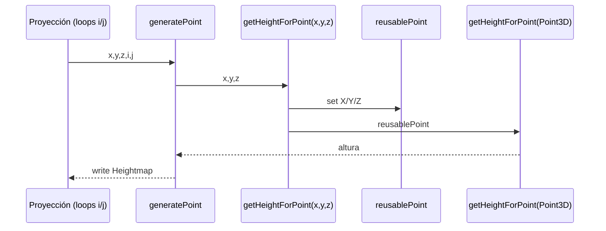
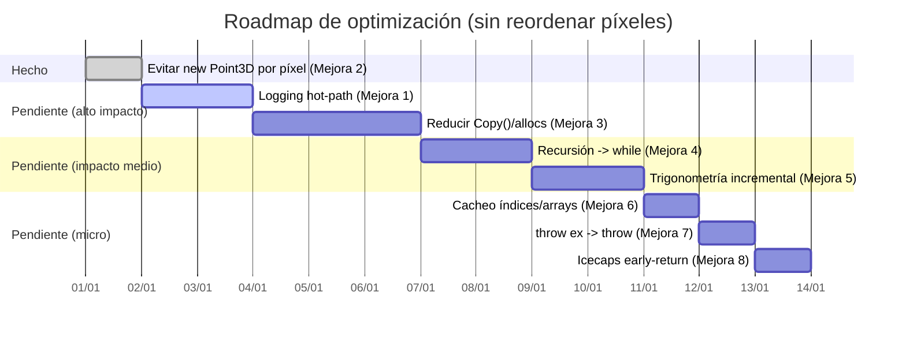

# Efficiency results

Tabla histórica para comparar cambios de eficiencia del proyecto con el tiempo.

Cómo generar una nueva fila:

- `dotnet run -c Release --project Console/WorldGen.Console.TestConsole/WorldGen.Console.TestConsole.csproj -- efficiency docs/efficiency-results.md`

La consola añadirá una nueva fila (si no existe ya) con la fecha y los tiempos por resolución.

| Date			| CVGA 320x200	| QVGA 320x240	| VGA 640x480	| SVGA 800x600	| HD 1280x720	|
| -------------	| -------------	| -------------	| -------------	| -------------	| ------------- |
| 2026-01-28	| 2,09 s		| 2,18 s		| 10,21 s		| 13,337 s		| 28,552 s		|
| 2026-01-29	| 3,252 s		| 1,984 s		| 7,899 s		| 11,68 s		| 24,897 s		|
| 2026-01-27	| 2,09 s		| 1,68 s		| 6,936 s		| 10,887 s		| 19,968 s		|
---

# Estado de optimizaciones (TetrahedralSubdivision)

Resumen de mejoras de eficiencia para `WorldGen.Algorithm.TetrahedralSubdivision.TetrahedralSubdivision`, con la restricción de **no alterar el orden de evaluación de píxeles** (relevante para coherencia fractal).

```mermaid
flowchart TD
  A[Objetivo: acelerar sin reordenar píxeles] --> B[Reducir allocs/GC]
  A --> C[Reducir coste matemático]
  A --> D[Reducir overhead de infraestructura]

  B --> B2[Mejora 2: evitar new Point3D por píxel]
  B --> B3[Mejora 3: reducir Copy()/allocs en subdivisión]
  C --> C4[Mejora 4: recursión -> while]
  C --> C5[Mejora 5: trigonometría incremental]
  D --> D1[Mejora 1: logging hot-path]
  D --> D7[Mejora 7: throw ex -> throw]
  D --> D6[Mejora 6: cacheo de índices/arrays]
  D --> D8[Mejora 8: early-return icecaps]
```

## Mejoras implementadas

### Mejora 2: evitar `new Point3D` por píxel

**Qué se cambió**

- Se eliminó la asignación `new Point3D(x, y, z)` dentro del hot-path por píxel.
- Se añadió un `Point3D` reutilizable a nivel de instancia y una sobrecarga `getHeightForPoint(x, y, z)`.

**Motivación**

`Point3D` es una `class` (heap). Con resoluciones típicas (800×600), el código original creaba ~480k objetos por mapa solo en la conversión `(x,y,z)->Point3D`, aumentando presión de GC.

**Cómo funciona ahora**



**Ficheros**

- `Core/Algorithm/WorldGen.Algorithm.TetrahedralSubdivision/TetrahedralSubdivision.cs`

**Nota**

Esta técnica asume ejecución secuencial. Si el cálculo se paralelizase en el futuro, el `Point3D` reutilizable tendría que ser `ThreadLocal` o por hilo.

## Mejoras pendientes

### Mejora 1: reducir logging en hot-path

- Problema: llamadas por píxel / por nivel de profundidad son muy costosas.
- Acción: condicionar logs a `DebugMode` o sampling; mantener logs solo a nivel de proyección/creación.
- Impacto esperado: muy alto.

### Mejora 3: reducir `Copy()`/allocs en subdivisión

- Problema: `TetrahedronPoint.Copy()` clona objetos en bucles muy profundos; además cada asignación a `Tetrahedron.A/B/C/D` recalcula lados.
- Acción: reducir clones, reutilizar instancias y/o evitar recalcular todos los lados por cada setter.
- Impacto esperado: alto.

### Mejora 4: recursión -> `while`

- Problema: overhead de llamadas recursivas en `getHeightForPoint`/`getHeightForPointOld`.
- Acción: convertir a iterativo preservando exactamente el orden de mutaciones/decisiones.
- Impacto esperado: medio.

### Mejora 5: trigonometría incremental por fila

- Problema: `Math.Sin/Math.Cos` por píxel en varias proyecciones.
- Acción: recurrences `sin/cos` por incremento de `theta`.
- Riesgo: pequeñas diferencias por floating-point; considerar como modo rápido opcional.
- Impacto esperado: medio–alto.

### Mejora 6: cacheo de índices y arrays

- Problema: recalcular `j*Width+i` y accesos repetidos a propiedades.
- Acción: cachear `heightmap`, `width` y `rowBase` por fila.
- Impacto esperado: bajo–medio.

### Mejora 7: `throw ex;` -> `throw;`

- Problema: `throw ex;` pierde stack trace.
- Acción: usar `throw;`.
- Impacto esperado: rendimiento bajo, diagnóstico alto.

### Mejora 8: `doLatitudeIcecaps` early-return

- Problema: trabajo extra cuando `IsDoLatitudeIcecapsSet == false`.
- Acción: retorno temprano.
- Impacto esperado: bajo–medio.

## Roadmap sugerido



