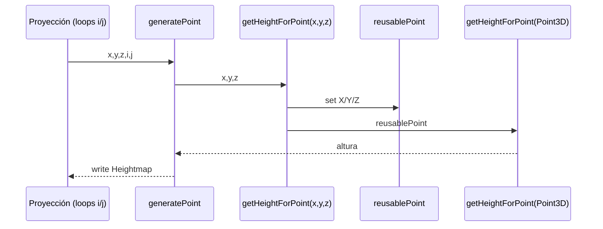
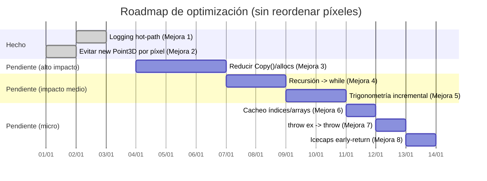

# Estado de optimizaciones (TetrahedralSubdivision)

Resumen de mejoras de eficiencia para `WorldGen.Algorithm.TetrahedralSubdivision.TetrahedralSubdivision`, con la restricción de **no alterar el orden de evaluación de píxeles** (relevante para coherencia fractal).

```mermaid
flowchart TD
  A[Objetivo: acelerar sin reordenar píxeles] --> B[Reducir allocs/GC]
  A --> C[Reducir coste matemático]
  A --> D[Reducir overhead de infraestructura]

  B --> B2[Mejora 2: evitar new Point3D por píxel]
  B --> B3[Mejora 3: reducir Copy()/allocs en subdivisión]
  C --> C4[Mejora 4: recursión -> while]
  C --> C5[Mejora 5: trigonometría incremental]
  D --> D1[Mejora 1: logging hot-path]
  D --> D7[Mejora 7: throw ex -> throw]
  D --> D6[Mejora 6: cacheo de índices/arrays]
  D --> D8[Mejora 8: early-return icecaps]
```

## Mejoras implementadas

### Mejora 1: reducir logging en hot-path

**Qué se cambió**

- Se añadió un flag interno `hotPathLoggingEnabled` en `TetrahedralSubdivision`.
- El flag se sincroniza con el parámetro `DEBUG` (`hotPathLoggingEnabled = DebugMode`).
- En métodos del hot-path, se evitó ejecutar logging de errores y la reflexión asociada cuando el flag está desactivado:
  - `setFixedPointValue(...)`
  - `generatePoint(...)`
  - `getHeightForPoint(Point3D ...)`

**Motivación**

Aunque gran parte del logging por píxel ya estaba comentado, quedaban llamadas a `WriteLogError(MethodBase.GetCurrentMethod(), ex)` que forzaban `MethodBase.GetCurrentMethod()` (reflection) incluso con debug apagado.

**Impacto esperado**

- Menos overhead en el camino excepcional y evita reflection innecesaria cuando `DEBUG=false`.

**Ficheros**

- `Core/Algorithm/WorldGen.Algorithm.TetrahedralSubdivision/TetrahedralSubdivision.cs`

### Mejora 2: evitar `new Point3D` por píxel

**Qué se cambió**

- Se eliminó la asignación `new Point3D(x, y, z)` dentro del hot-path por píxel.
- Se añadió un `Point3D` reutilizable a nivel de instancia y una sobrecarga `getHeightForPoint(x, y, z)`.

**Motivación**

`Point3D` es una `class` (heap). Con resoluciones típicas (800×600), el código original creaba ~480k objetos por mapa solo en la conversión `(x,y,z)->Point3D`, aumentando presión de GC.

**Cómo funciona ahora**



**Ficheros**

- `Core/Algorithm/WorldGen.Algorithm.TetrahedralSubdivision/TetrahedralSubdivision.cs`

**Nota**

Esta técnica asume ejecución secuencial. Si el cálculo se paralelizase en el futuro, el `Point3D` reutilizable tendría que ser `ThreadLocal` o por hilo.

### Mejora 3: reducir `Copy()`/allocs en subdivisión

**Qué se cambió**

- Se optimizó `TetrahedronPoint.Copy()` para evitar asignaciones explícitas por copia y pasar a un clon superficial con `MemberwiseClone()`.
- En `Tetrahedron` ya existía infraestructura para reducir recálculo de lados durante mutaciones:
  - Flag `autoRecalculateSides` para evitar `calculateSides()` en cada `set`.
  - Métodos `UpdateA/B/C/D(...)` que actualizan solo longitudes afectadas (`UpdateSidesForX`) y recalculan `LongestSide`.

**Motivación**

En subdivisiones profundas, las copias de puntos y los recálculos de longitudes pueden disparar el coste total (allocs/GC + CPU). Esta mejora reduce el coste de copiar puntos y permite mutaciones con recálculo parcial.

**Impacto esperado**

- Menos presión de GC (menos asignaciones) en caminos que copian puntos con frecuencia.
- Menos CPU por evitar recalcular todas las longitudes cuando solo cambia un vértice.

**Ficheros**

- `Core/Algorithm/WorldGen.Algorithm.TetrahedralSubdivision/BE/TetrahedronPoint.cs`
- `Core/Algorithm/WorldGen.Algorithm.TetrahedralSubdivision/BE/Tetrahedron.cs`

## Mejoras pendientes

### Mejora 1 (ampliación): logging hot-path completo (opcional)

- Estado: parcialmente solucionado (flag + guardas en `WriteLogError` del hot-path).
- Pendiente: si se reactivan `WriteLogFunctionEnter/Exit` en hot-path, protegerlos también con el flag y evitar `MethodBase.GetCurrentMethod()` cuando esté desactivado.
- Impacto esperado: alto si se vuelve a habilitar logging por píxel.

### Mejora 3 (ampliación): reducir `Copy()`/allocs adicional (pendiente)

- Estado: implementada.
- Hecho:
  - `Tetrahedron.SwitchSides(...)` ya no clona (`Copy()`), ahora intercambia referencias (`swap`) y recalcula longitudes.
  - `Tetrahedron.Reorder()` ya no usa recursión; se convirtió a bucle iterativo.
- Impacto esperado: medio–alto.

### Mejora 4: recursión -> `while`

- Problema: overhead de llamadas recursivas en `getHeightForPoint`/`getHeightForPointOld`.
- Acción: convertir a iterativo preservando exactamente el orden de mutaciones/decisiones.
- Impacto esperado: medio.

### Mejora 5: trigonometría incremental por fila

- Problema: `Math.Sin/Math.Cos` por píxel en varias proyecciones.
- Acción: recurrences `sin/cos` por incremento de `theta`.
- Riesgo: pequeñas diferencias por floating-point; considerar como modo rápido opcional.
- Impacto esperado: medio–alto.

### Mejora 6: cacheo de índices y arrays

- Problema: recalcular `j*Width+i` y accesos repetidos a propiedades.
- Acción: cachear `heightmap`, `width` y `rowBase` por fila.
- Impacto esperado: bajo–medio.

### Mejora 7: `throw ex;` -> `throw;`

- Problema: `throw ex;` pierde stack trace.
- Acción: usar `throw;`.
- Impacto esperado: rendimiento bajo, diagnóstico alto.

### Mejora 8: `doLatitudeIcecaps` early-return

- Problema: trabajo extra cuando `IsDoLatitudeIcecapsSet == false`.
- Acción: retorno temprano.
- Impacto esperado: bajo–medio.

## Roadmap sugerido

